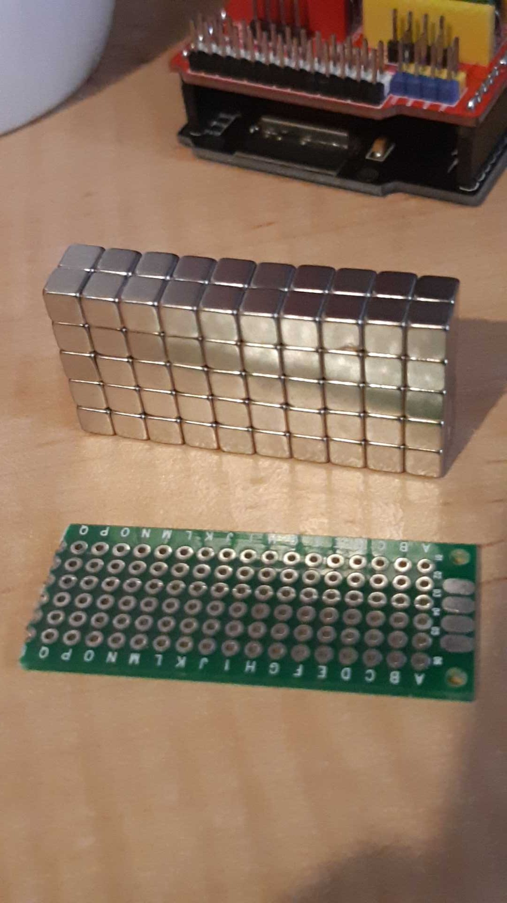

So, the trend for using strong rare earth magnets instead of clips is booming. The manual PnP uses them to attach thangs. So, I ordered 50. Received 100!

But ... there's a but ... but tant 5mm cubed, they're 4.65mm cubed, so potentially some hacking of the 3D design - unless that's the idiom and so already accommodated. Its very likely the idiom, given the caveats for measurements at Aliexpress.

Still waiting on the pneumatic plumbing and the promised correction to the cock-up of the extrusions - that is, the two pesky 400mm x 4020 extrusion. Not to mention the linear rail and block.
