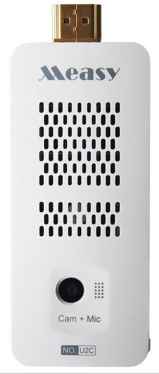

A little work and a little sweat and the help of Peter Abeles (the author of BOOFCV) and BOOFCV can compile in Processing for Android.
The fix is to break into the boofcv\_dependencies.jar and delete the xmlpull entry under: boofcv\_dependencies/org
The reason, the library is already being pulled in from somewhere else in the build and the build is not smart enough to ignore a replicated library and simply cracks up.
Simple fix.
Too early to know whether there will be any side effects - perhaps now in Java mode of the Processing IDE, since this fix appears to correct a problem in the Android mode.
In any event, we can move on with the experiments. I have quite a few android based toys with cameras after all.
[caption id="attachment\_1112" align="aligncenter" width="300"] JXD S7800B[/caption]

[caption id="attachment\_1272" align="aligncenter" width="169"] Cyclops![/caption]

