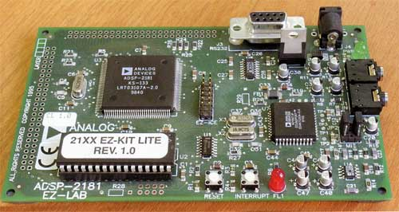
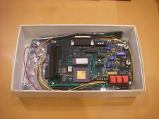

Up late, sick all week with flu so, since at home and not studying, well ... you know.
So I have bought a 3 1/2 inch floppy drive - usb of course - and I am trying to sneak my software for my Analog Devices DSP boards onto a drive for prosperity.
I had only found them in a box a couple of weeks ago and could not bring myself to throwing them out.
I have an EZKIT-LITE [2181](http://www.analog.com/static/imported-files/data_sheets/ADSP-2181.pdf "Fond memories") and  also a [2111](http://bitsavers.trailing-edge.com/pdf/analogDevices/ADSP-2111_Users_Manual_Architecture_Mar90.pdf "Another long lost toy") board.
Thank God for DOSBOX ... or at least the developers of DOSBOX.
 
[caption id="attachment\_1374" align="aligncenter" width="300"] ADSP 2181 EZ-LITE[/caption]
[caption id="attachment\_1375" align="aligncenter" width="225"] ADSP 2111 EZ-LAB[/caption]
These were the little cousins to the SHARC.
Now DISC 2 of 3 of the C-TOOLS is flaky so I am here with RUM nursing it.
Actually, while the disc failed it appeared to fail after expanding all but one file (the simulator exe for the ADSP2111).
This is a pain but I can go without the simulator if I have the compiler, assembler, PROMSplitter etc.
In fact, I poked around and the extraction is script driven.  On first inspection I thought I might not be able to get to files on the 3rd disc but, in fact, I just copied the installer exe onto that disc, edited the script file to only look for the third disc, and pulled off the disc the rest of the software, including the ADPS2181 simulator.
It all runs under DOSBOX so, worst case, I write a simulator in F83 lol.
Been there, done that!
**POST SCRIPT**
I found one(1) other person on the planet who has the ADPS 2111 EZ LAB board.  He was trying to sell it on EBAY (US) and no one wanted it - go figure.  So I have organised to get the missing software off him.
