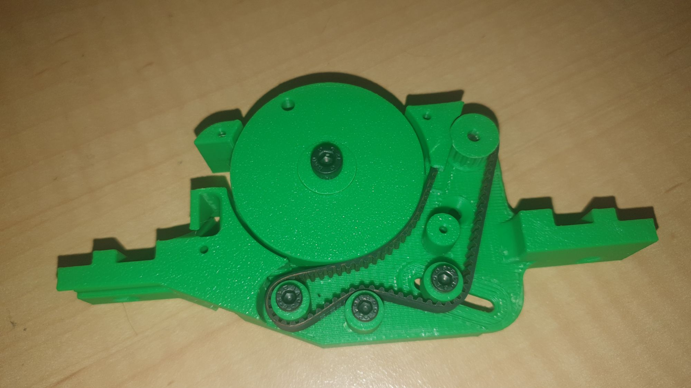
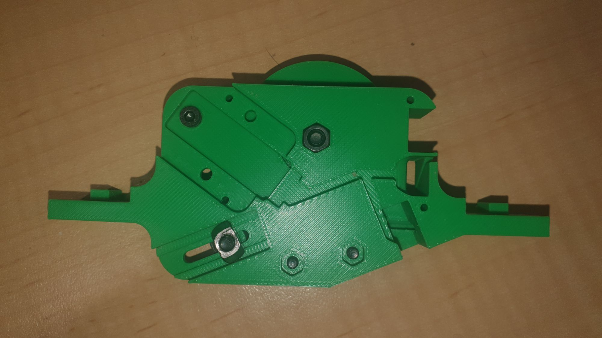

I came across, by chance, an open source design for a Pick'n'Place machine that had a rad' design from 8mm feeders that I fell in love with. Design is [here](https://github.com/ftobler/pick-plaz).

It's not well supported. No destructions and no BOM.

Regardless I had a play with printing the feeder on my Bambu Labs P1P.

I through out the first try as I had supports on auto, which infilled the snout that tape had to feed through. Bambu Studio has a way bettern manual paint mode for supports than the olde Flash Forge Studio (since it wanted you to drop a support in one at a time). Bambu Studio lets you paint where you want supports to go and also allows you to paint were you don't want supports to go. Hence I worked out a project with a clean supports model.

The attraction, it's a neat belt drive system.

As there was no BOM, although you can get somewhere close with the step file, I 3D printed mock "bearings" to let me mock up the feeder to muse over the design. Given there was no BOM I was toying with having to buy a few GT2 belts to find the right size. However, I had a 158 (79tooth) on me so that seems to fit but it could be a few teeth longer, I feel, to allow the tightening pulley to start from the middle of its travel.

On the flip side a standard 90 degree geared N20 motor (I think the step in not conclusive but indicative). The other thing is a (so called) **ITR9707** interupted IR LED/TRANS pair for the tape holes.

The original board on the feeder has a STM32F030C8TX but I'm going to redesign for ESP32 supermini, since it might be neat to ping the feeders using mqtt. Might need sort out a means to code position etc.

