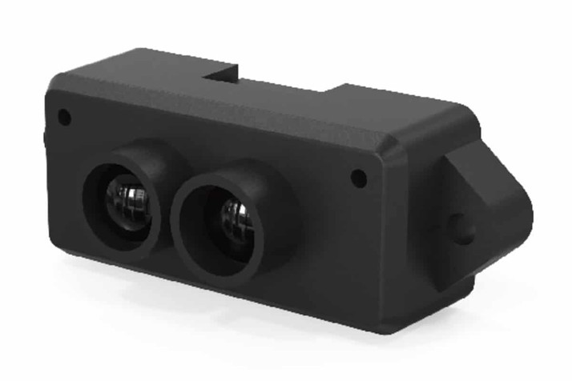
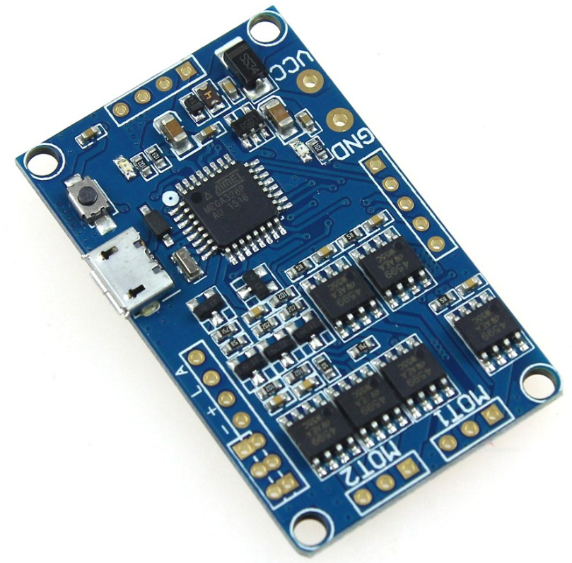

So my Benewake TF Mini LiDAR turned up.

Now for the fun.
It has to rotate in a circle to create a scan.
I had an idea to mount either of a Seeeduino Film or an ESP8266, with battery, on a spindle to wirelessly send readings - all while it is spinning.
Then BOOM!
You can get "hollow" spindle gimbal motors with slip rings!  So, again a
So, you can attach the TF Mini to the spinning part of the gimbal motor and drive the motor and take readings.
All good but for one thing.  Currently the idea is a open-loop solution.  It will need to be keyed to at least one position (at least) so that the "beams" are relative to a direction.
Hmmm!
So, being lazy I found a really cheap MEGA328P driven gimbal board, but I only want it for the gimbal driver and the ease of software hacking.

The beauty is is a clone of the Martinez toy, so it has code to manage the phases of the motor inputs.   Should be interesting as it looks like you only need a few functions to set it up to run a motor continuously, but who knows - I still have to read into the theory.
