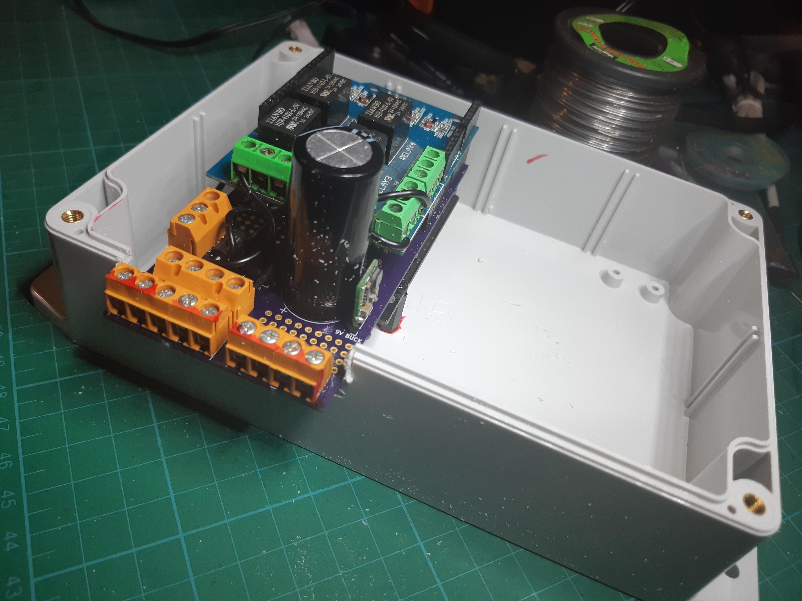
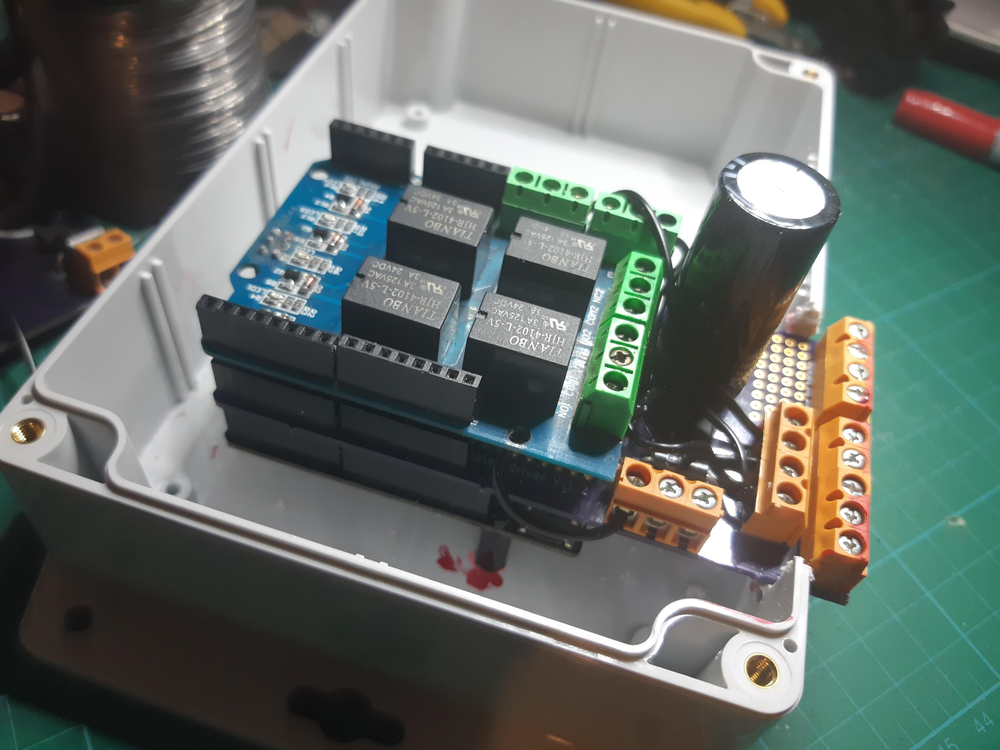
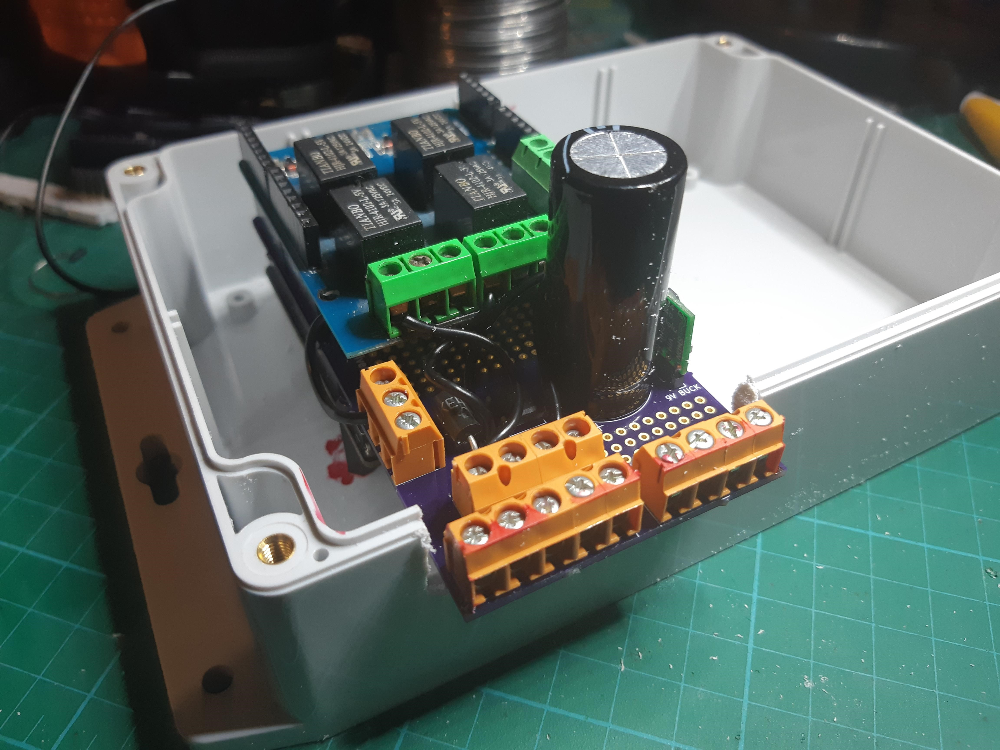
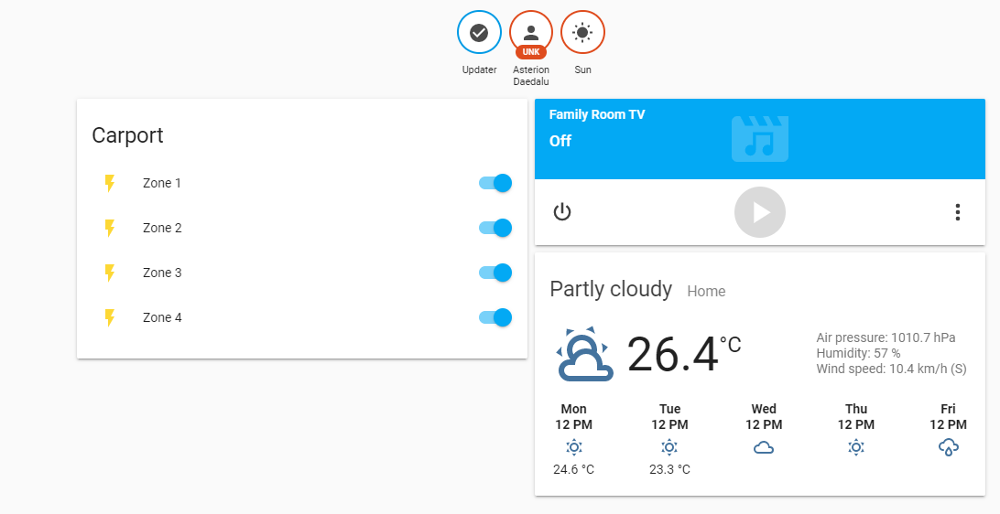
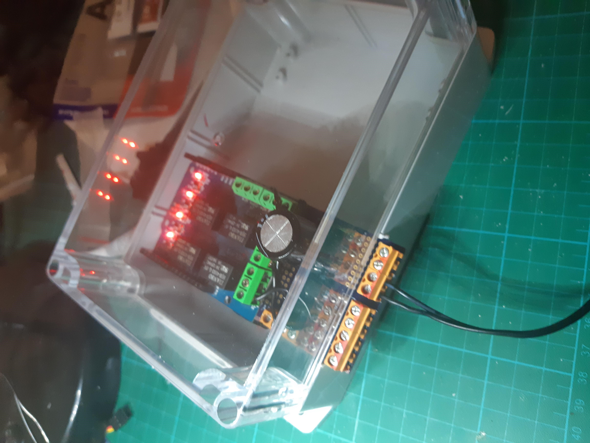

Still a little dusty from my Dremel work. I say Dremel work, I got a $30 "Dremel" from Aliexpress some time ago (is it or is it not a Dremel?). It says on the case "Made in America" but its bought from China! A little shady then.

It does run on AUS 230VAC.

I cut the foreign plug off and connected an AUS plug. Only problem, it seems to have a preference in the wiring up the active and neutral (would work one way but not the other). The problem being the way it is happy to wire up seems to have the spindle turning the wrong way, so it loosens instead of tightening the chuck. Oh well. If it becomes a problem I guess I will buy a real one from a local supplier. No problem so far.

Keeping the price down on this sucker is hard. I used up all the 100uF caps I got from Aliexpress, the sucker in the photo is $8! The case is, yes, big. The problem, the next size down would just fit the board if I redesign the board. I may do that since the use of the screw posts inboard turned out to be clumsy (might as well solder to board). Not to mention, it interferes with lid of this box, so I will remove screw post and solder to board. The box is $24!

This is fine for my personnel hacks.

Yep, I will have to jump the 24VAC inputs from side terminals to end terminals ... clumbsy. So, more thinking through things required in future.

Works a treat with ESPHome on board and hooked into Home Assistant. I have "switches" to manually turn it on/off. You can turn it on and it will water for 15min and turn itself off using an automation. To run all four I am using sunrise and sunset events and simply chaining the watering of zones, so that all four are not on at once.

I will still persist with the node-red version, with [my own sprinkler code](https://github.com/Bazmundi/opensprinklette), as an alternative. As I am still keen to glue the [parser](https://organicmonkeymotion.wordpress.com/2018/11/11/pegaleg/) I wrote into the node-red and as the means to interpret the google calendar event title.

Voila!
