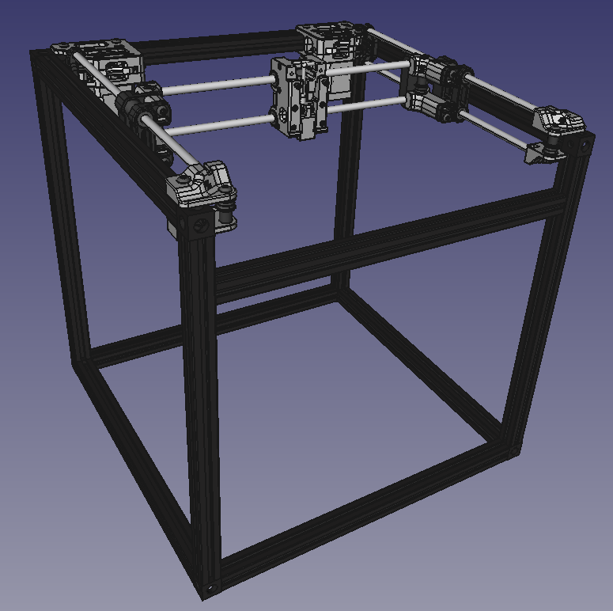
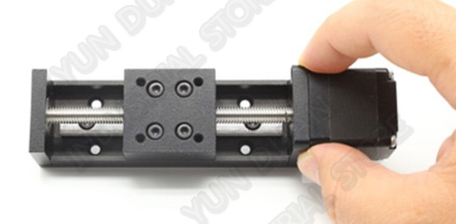
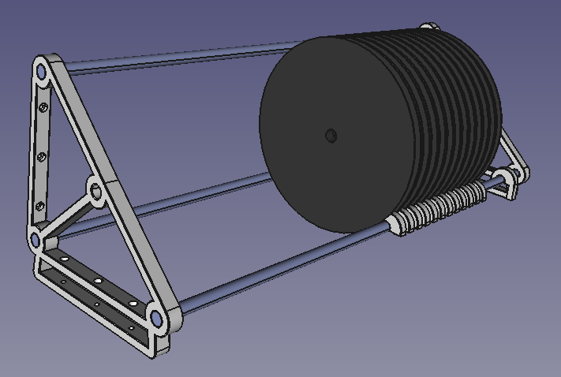
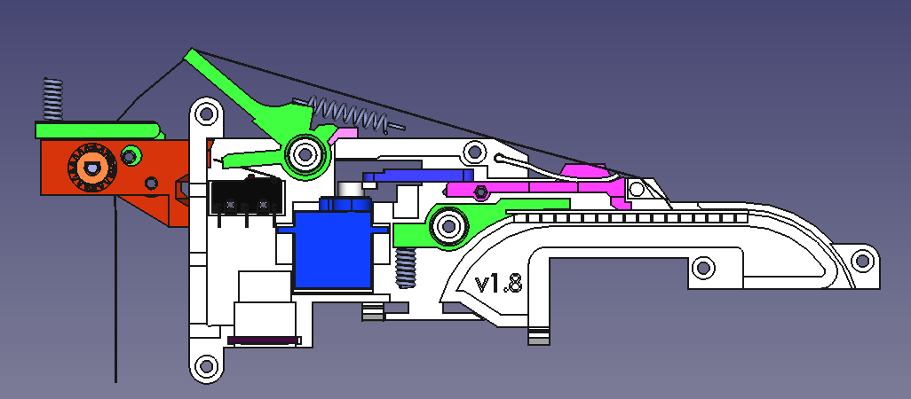

I found the Voron range of open source corexy printers. The V0 and V1 seem options for my craving for a corexy driven PnP. BUT.

The [Voron Legacy](https://www.vorondesign.com/voron_legacy) seems to tick the box for economy.

With the configurator I was able to set up for a build using 3 Way Angle Connection Rectangular Box, to set the frame external dimensions to 590x590x440. That craftily leaves me with standard T-slot lengths of 8x550mm (550 xy) and 4x400mm 2020 (440 z). Even better that actually translates to standard off the shelf lengths of 8mm linear shaft of 6x8x500mm, with no need for z shafts (you'll see why below).

The height of 440mm is so I can stow a rack of 7" smt reels in the frame.

So, something like Figure 1 as a start. This is not the proportions I have mentioned. I started with the step file for the Voron Legacy and deleted all the none essentials. You don't appear to be able to edit the components once imported. Probably just my evolving understanding of CAD tools?

Figure 1

I also opted to do something lazy, I am only wanting this for small runs and to be an economical build, both in terms of money and construction. So I opted for a single 50mm linear drive to provide the Z-axis at Figure 2. So that is a single pick-n-place head.

Figure 2

I will then need to design a coupling between the X gantry and the Z-axis. It will need the down looking camera etc.

Reel holder is already sorted as per figure 3. Just gets mounted onto frame.

Figure 3

Feeder, well, something like Figure 4. Find the details of the reel and feeder [here](https://docs.mgrl.de/start).

Figure 4
