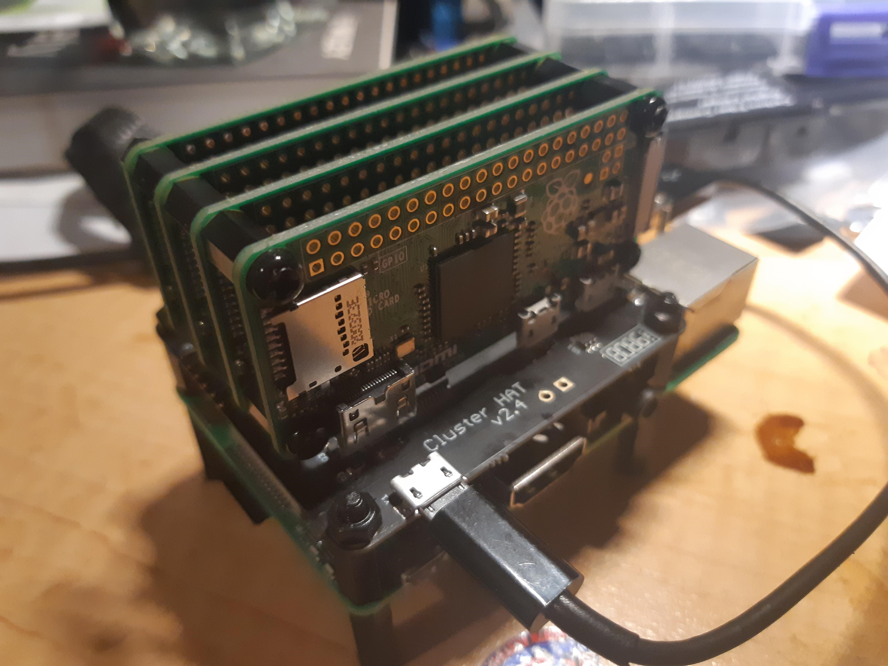
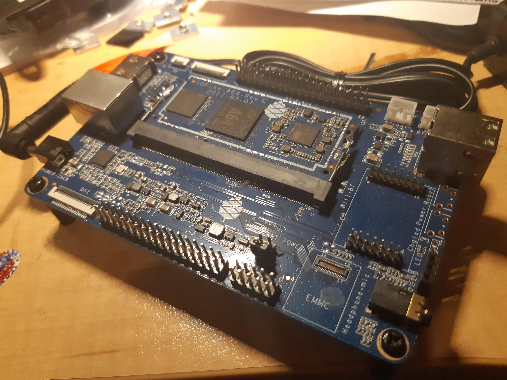

So, I ended up splurging on a RPi3 (not +), enough to sit a clusterHAT upon, since I learnt my lesson with my RPi3+ home server and NOT using it for cluster experiments.

I fragged something and had to re-image the SD card. DOH!

Now with 4 RPi Zero (Hardkernel ODRIOD W clones) atop, I find I marvel at the design, since I was able to bolster the setup with 3M nylon posts that fitted EXACTLY! Voila!

**Brilliant!**

However, that will serve to help me finish my Docker course (I got up to the SWARM part and no cluster DOH!). Some wag at work suggested a virtual machine setup, but why would you ;)

Otherwise, I am setting up now with my SOPINE64 baseboard to setup the SOPINE 64 for my clusterboard.

Interesting find was also that someone has a image for SOPINE64 to run them on a clusterHAT. So, whether, once the clusterboard is setup, I re-purpose this SOPINE64 baseboard as another 20 but not 8 core cluster is another interesting question.

Would that be too much?
