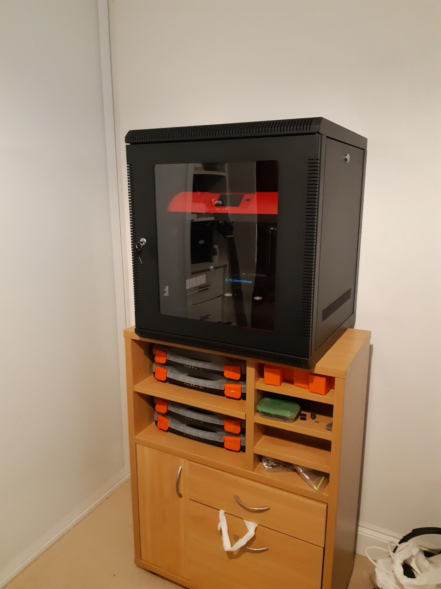
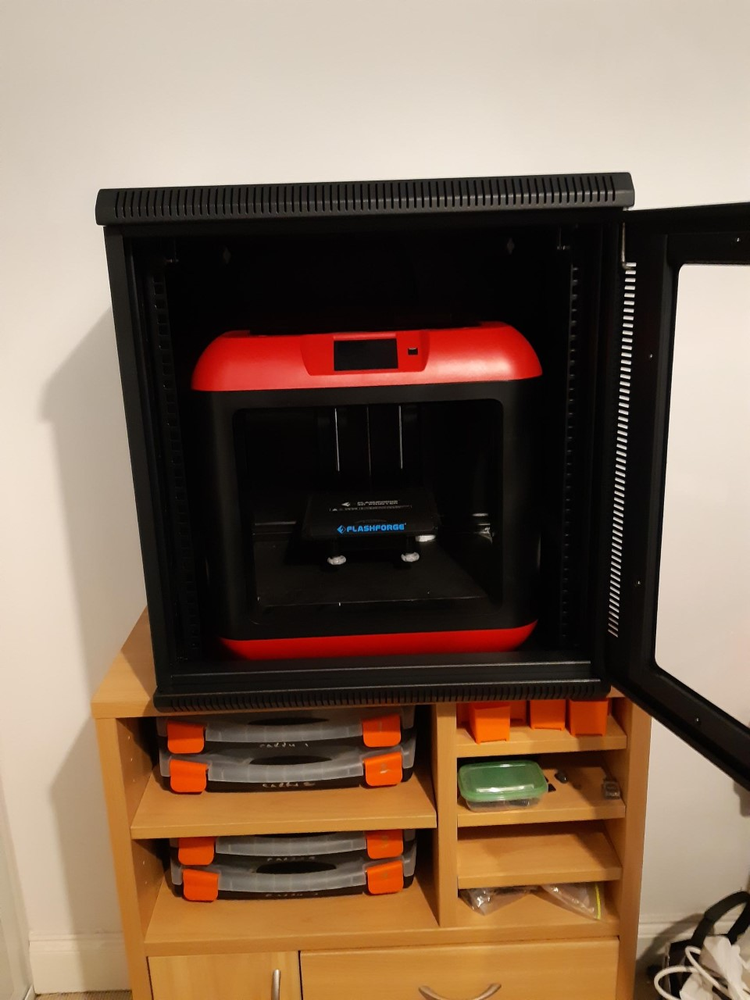

So, I was having too much trouble with the extrusions warping and shrinking. Part of the issue was, I suspect, the aircon. So, the room was too cold.

The other, well, I assume the plastic reel that comes with the printer might have been low quality OR had absorbed moisture (there is some chatter on that on the web).

In any event I looked around for a box to stuff the printer into. I did almost go for a couple of 19 inch boxes at the auctions, but they went too fast.

So I opted to get an [11U 19 inch box from a mob from interstate](https://www.ebay.com.au/itm/11U-11RU-Server-Network-Data-Rack-LAN-Cabinet-19-19-Inch-Wall-Mount-508mm-Deep/221639457612?_trkparms=aid%3D111001%26algo%3DREC.SEED%26ao%3D1%26asc%3D20160908105057%26meid%3D79fd1ef824284839aa736c92366b751e%26pid%3D100675%26rk%3D2%26rkt%3D12%26mehot%3Dpp%26sd%3D323194598113%26itm%3D221639457612&_trksid=p2481888.c100675.m4236&_trkparms=pageci%3A37961287-47b7-11e9-89a9-74dbd18088cf%7Cparentrq%3A8540694a1690ac88dad32bdffffd0eef%7Ciid%3A1). I can recommend them, they are very very helpful. I did have them triple check dimensions for me before I bought the item.

It is a perfect fit for the flashforge finder! The flash finder is a 420mm cube. The printer slides in the open door. The two side panels come off for access as well. The height leaves room enough for the feed tube. Did I say perfect!

All I need do now is sort a small fan heater to warm the interior of the box. I will sort a temperature control et cetera.

Only downside? Faraday shield! So, I can't connect by wifi no more no more. So, I need a long USB cable. No matter.
