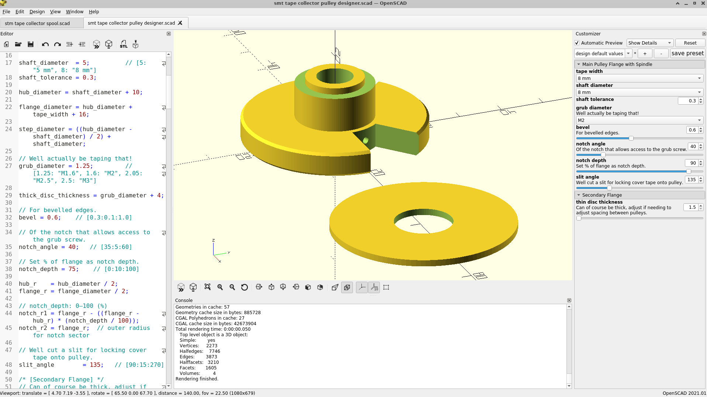
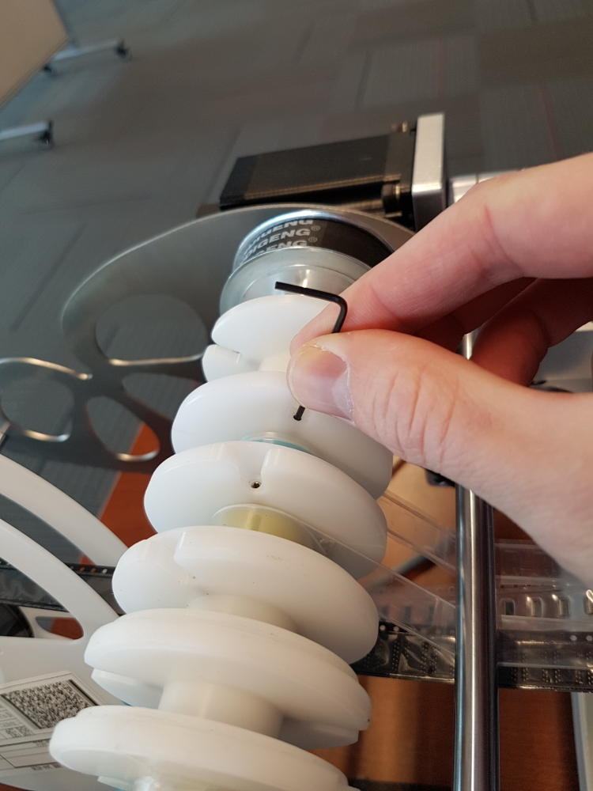

I hacked up a tidy SMT cover tape collecting pulley for my automatic PnP build, available at [Thingiverse](https://www.thingiverse.com/thing:7201317).

I opted out of fancy "bearing" and went for a snug but loose fit, since the grub screw will provide the adjustable "friction" and that will also likely be via some leveraging of the pulley against the shaft.

Some variability in the designer to allow tuning.

Used in friction driven setups seen at the [sparkfun](https://news.sparkfun.com/2588) site:

