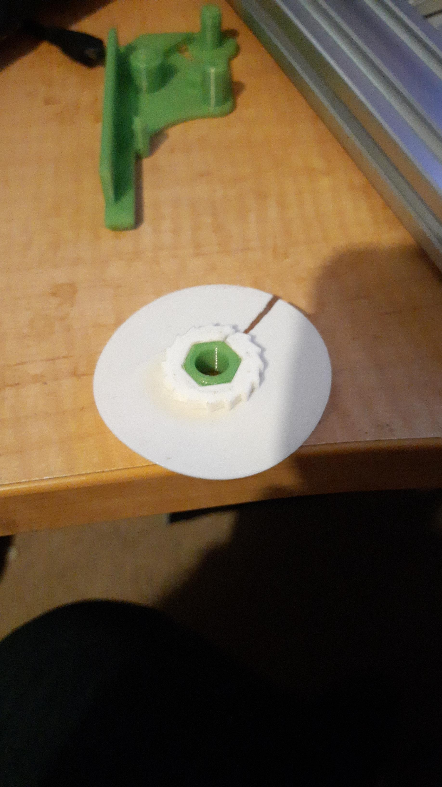

Arrrggghhhh!

So, forget the "snug" setting. It does not adjust for this problem.

So, I changed:

`reel_axle=13`

to:

`reel_axle=13; // [13:0.1:14]`

So I set it to 13 to generate STL for the "friction wheel", and bump it up a tad when printing the "spool left". Since the value is used for both.

You could do something like:

`reel_axle=13; // [13:0.01:14]`

The point is instead of having a HMI widget scrolling whole mm, you can scroll part there of.

That line of code is sitting in the [PushPullFeeder.scad](https://github.com/markmaker/PushPullFeeder/blob/master/PushPullFeeder.scad) file at [this git site](https://github.com/markmaker/PushPullFeeder).

I also had to do something similar with the:

`tape_inset_begin`

`tape_inset_end`

To tweak it since the tape inset would not fit the body as the mating section was too short. The mm "tuning" of either one end or the other would move the whole inset one direction or the other, and best you could do was either 1mm or 2mm change in length, whereas a finer tuning to also keep the inset in the same spot seemed to make more sense.
