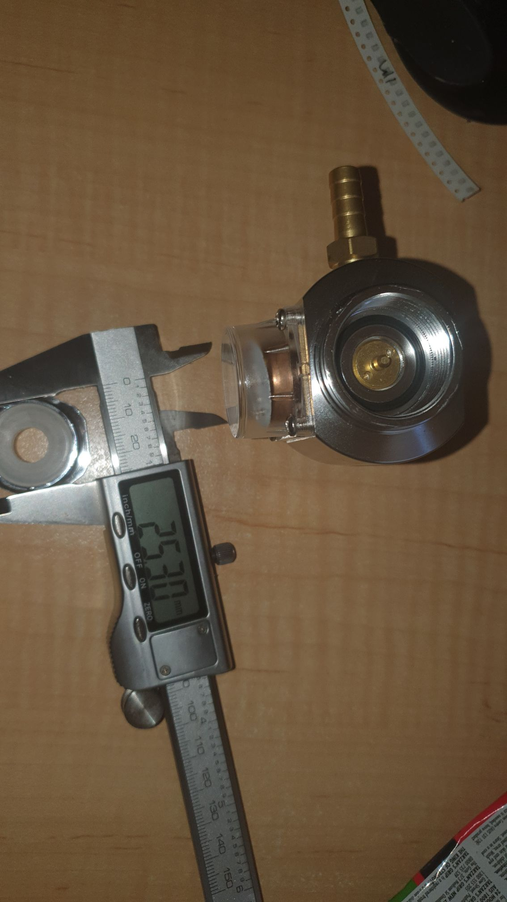

I just sent an email to a beer keg company to see if they can help.

The problem was I didn't do enough research.

The regulator I bought from Aliexpress has an internal T21-4 thread, where as in Australia Sodastream bottles have (what I want to say) a W21.8-14. Which, go figure, ChatGPT seemed to think was similar, but is not by a long shot.

Hence, as long as the beer keg company, who make their own regulators are ameanable to sell me an OZ Sodastream adaptor, and the thread adaptor they sell fits my regulator, then problem solved.

Otherwise, while they have mini regulators, I need 90-100psi rather than the 60psi they offer.

Poking around, I might be able to pull the bits together for a 150psi regulator.

FRACK!
