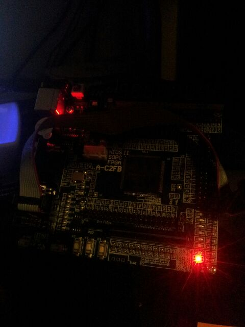

 
So, not much to report.  Re-reading final Master's coursework assignment (four years of UGHHHHH!) and so dusted off the FPGA training board to bomb something onto it to buzz it out.
Went for the "Hello World" of FPGA and chose a Verilog example for lighting an LED.
Mostly an exercise to get used to the Quartus II software; set up USB Blaster drivers, work out which of two sockets the JTAG cable goes into; final steps setting up programming from Quartus etc.
Nice glass of CabSav with the red glow of the LED also helpful.
 
