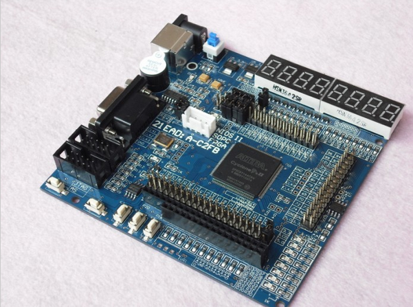
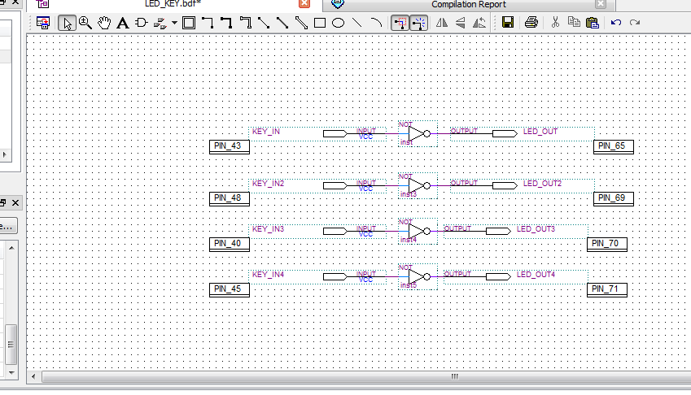

No red wine this time.  Some stout instead.
So experiment 2 - adding a switch to turn the led on and off.  Gripping stuff!
So, the board comes with switches connected to inputs on the FPGA so just jumping in and going for it.

In fact:

|  |  |  |
| --- | --- | --- |
| K1 | INPUT | PIN\_43 |

|  |  |  |
| --- | --- | --- |
| D30 | OUTPUT | PIN\_65 |

So closed Exp.1 file and opened Exp.2.
Something new.  Compiling the file is fine.  When I open the "Programming" window for the first time it balks with "Cannot add target device EPCS4 when in current programming mode" - something to chase down sometime but lets push on.
When using the "Auto Detect" function in the "Programmer" window it adds an EP2C5 device to the chain - which I suspect is sitting in the USB Blaster.
Once the x.sof file for the project is added, the target device is chained with the EP2C5.  The EP2C5 selected in the window and can be deleted from the chain.
Once programmed the LED on PIN\_65 is lit and it is unlit when you press the switch on PIN\_43.

#### Changing it up

So, simple enough change is to tie four LED to four switches.
Except...
... first up, what is not intuitive is that when you are in Pin Assignment tool, you can manually set direction.  This wasn't a problem in the end once you go and compile but when you first make the assignment it won't allow you to set it.  Turns out, if you are using the schematic it was set when you created an input pin type.  The problem, it doesn't get reflected into the pin assignment when you make it initially.
However, the steps outlined in the training material seem to reflect this anyway - you need to compile so the Pin Assignment tool picks up the pin directions.
Second problem.  For what ever reason simply adding 3 extra circuits seems to simply light up all LEDS on board, including 7-segment displays ... and buzzer ... hmm.
Started new project with only only switch and one LED - mirroring the one in the example library that comes with the board, still the same thing.
Next morning, after a long bike ride and a brunch ...
Usual Microsoft-like problem.  I deleted the project, unzipped it again from the archive, got one LED responding to each of the 4 keys in turn (reassigned and recompiled each single connection).  So there wasn't a problem with the switches.
Added a second circuit to the schematic of the refreshed project and voila! it is okay this second time around.  No obvious reason for not working the first few times.
Thus, all four switches finally included.
So:

|  |  |  |
| --- | --- | --- |
| K1 | INPUT | PIN\_43 |
| K2 | INPUT | PIN\_48 |
| K3 | INPUT | PIN\_40 |
| K4 | INPUT | PIN\_45 |

|  |  |  |
| --- | --- | --- |
| D30 | OUTPUT | PIN\_65 |
| D31 | OUTPUT | PIN\_69 |
| D32 | OUTPUT | PIN\_70 |
| D33 | OUTPUT | PIN\_71 |

On our way again.
**POST SCRIPT**
Now I thought I would add a glyph and, of course, I opened the project again to screen capture the schematic.  Go figure, only two circuits were in the schematic (the picture below has been corrected).
When I looked at the pin assignment all the pins were there, the components for the second two circuits were "missing" from the schematic.  I compiled the schematic and voila! software crashed and bailed out to operating system.  I had to go back in and re-add the components damn it!
Any old way, not that exiting but why does it have to be so niggly.  Seems the Quartus software is quite buggy at version 10.1.  Can't, upgrade as I need 10.1 for the chips I have in my development boards.
Won't be a problem once I have gone through the pain of learning FPGA design as I will move to updated chips.  Better not be.  I still have my Xilinx boards to tackle once the Altera exercises are done, so we'll see if there is a different in the quality of the software tools then
 
[caption id="attachment\_976" align="aligncenter" width="300"] Just block copy right ... well ... er ... things do come amiss[/caption]
