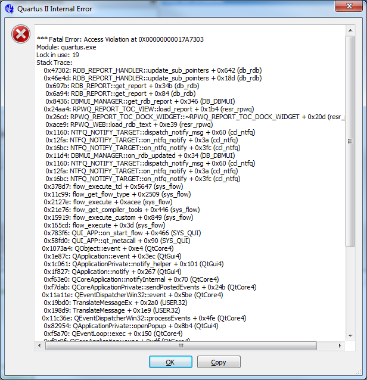
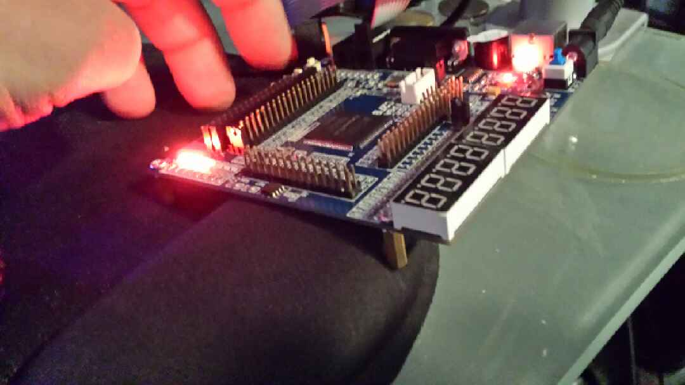

Gag!
[caption id="962" align="aligncenter" width="289"] Bugger![/caption]
Now I am actually known for finding bugs in things.  I even got a contract letter from L3 to the company I was working for in Canada that requested I be taken off testing BECAUSE I was holding up the project BECAUSE I was finding bugs - I was so proud, regretted keeping a copy of the letter for my CV LOL.
So, how did I get this error.  Well, straight forward really. I took the next example, which was the Verilog rather than schematic example of the switch plus the LED and modified it.  It worked alright unmodified but I wanted to extend it to use an array of switches inputs.
Unmodified it started out as:

module KEY1\_NOT\_LED ( A, F );

input A ;
output F;
assign F =~A;

endmodule

Now it turned out setting up the array wasn't that straight forward.
I just did something as kooky as the following:

module KEY1\_NOT\_LED ( A, F );

input [3:0] A ;
output [3:0] F;
assign F[0] =~A[0];
assign F[1] =~A[1];
assign F[2] =~A[2];
assign F[3] =~A[3];

endmodule

Now this didn't work, of course, when I went to assign the pins to ports as the pin assignment would want to assign them as an IObank it would appear.  No problem.  I decided to compile anyway - expecting I would have to go for another approach anyway and voila! the crash bang boom!
Now restarting the Quartus tool and no crash.  Compiles and I can bomb chip.  A single LED lights but we know that isn't right.  This points to a quirk in the project that sees the pin assign balk when trying to assign pin 43 - the software feels this is already assigned??  This seems to suggest database in some kooky state.  Why you ask?  Well pin 43 was assigned as input in the unadulterated code prior to the mod and the crash.  All good, read on.
Of course, the resultant code that I should have written in first place included creating a module that would be instanced:

module KEY2LED (input K, output L);

assign L =~K;

endmodule

 And then simply calling it four times:

module KEY1\_NOT\_LED ( input K1,K2,K3,K4, output L1, L2, L3, L4 );

KEY2LED (K1,L1);
KEY2LED (K2,L2);
KEY2LED (K3,L3);
KEY2LED (K4,L4);

endmodule

Assigning keys and LEDS:

|  |  |  |
| --- | --- | --- |
| K1 | INPUT | PIN\_43 |
| K2 | INPUT | PIN\_48 |
| K3 | INPUT | PIN\_40 |
| K4 | INPUT | PIN\_45 |

|  |  |  |
| --- | --- | --- |
| D30 | OUTPUT | PIN\_65 |
| D31 | OUTPUT | PIN\_69 |
| D32 | OUTPUT | PIN\_70 |
| D33 | OUTPUT | PIN\_71 |

So, upshot voila! it recompile, seemed to clear up database and:
 
[caption id="970" align="aligncenter" width="300"] Look closely, only 3 LED glowing ... no really ... look harder[/caption]
