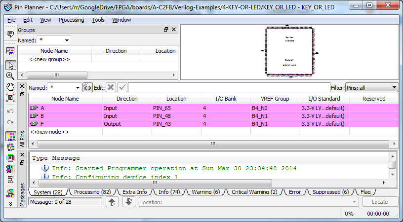
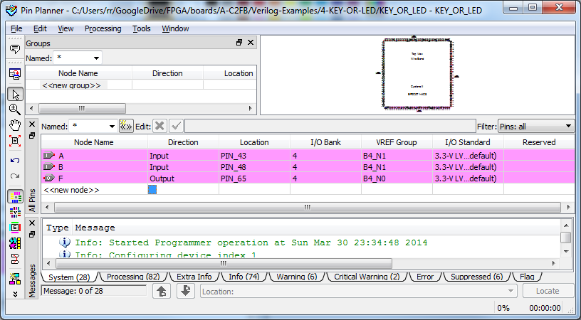
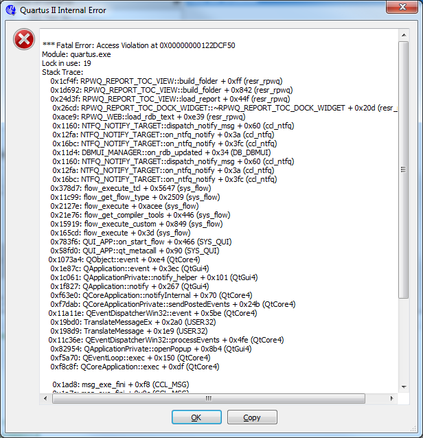

Gag!
Code was simple enough:

module KEY\_OR\_LED ( A, B, F );

input A, B;
output F;
assign F = A||B;

endmodule

But the pin assignments in the default example project didn't make sense, they were set to:
[caption id="attachment\_982" align="aligncenter" width="450"] wrong[/caption]
 
I went with it, just in case I was missing something, but compiled, bombed and no LED lit.
Changed to:
[caption id="attachment\_983" align="aligncenter" width="450"] right[/caption]
Got:
[caption id="attachment\_984" align="aligncenter" width="450"] again[/caption]
 
But held my breath and restarted and got a circuit that worked counter intuitively until I dusted off me logical thinking.  No LED lit if either of the buttons weren't pressed.
No LED lit if one of the buttons pressed and ... finally ... LED lit when both buttons pressed.
Basically both inputs are held high by a 4.7K ohm resistor and you need to drive both low to drive the LED low because of the OR function (either input high then high at output then LED sees same voltage at each of it's pins - 3.3V).
All good.
