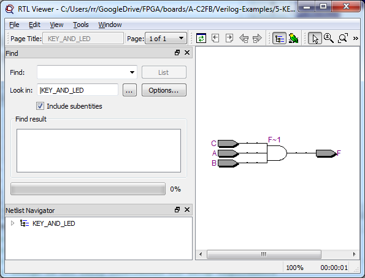
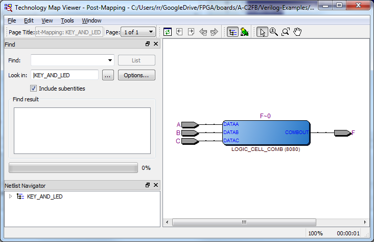
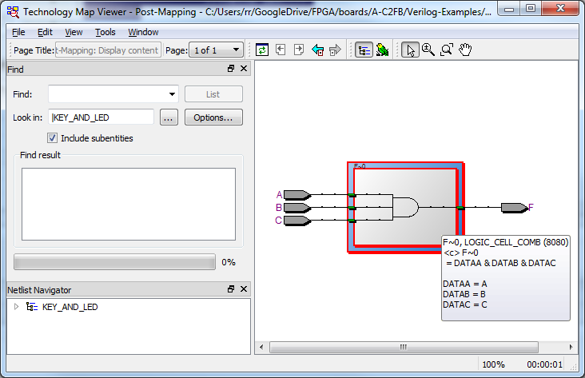
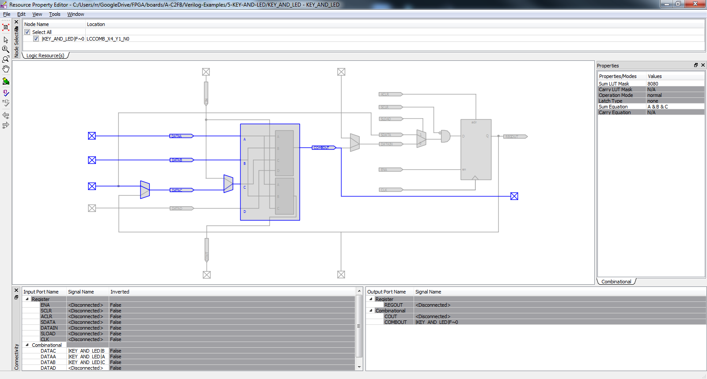
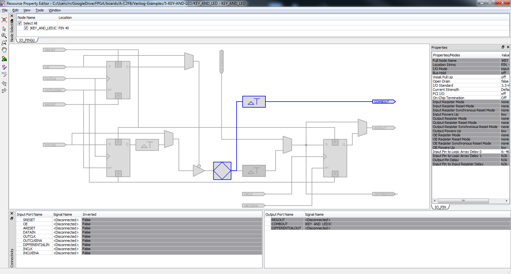
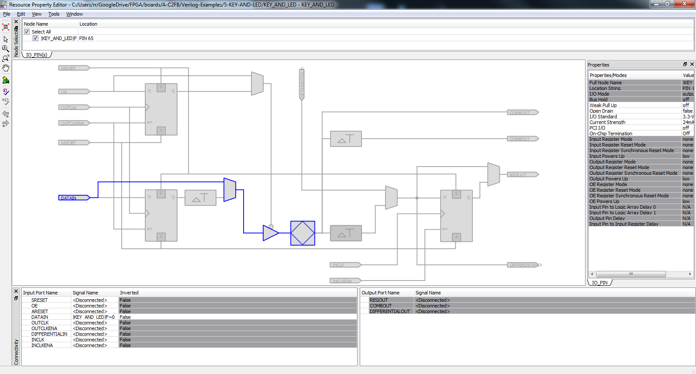
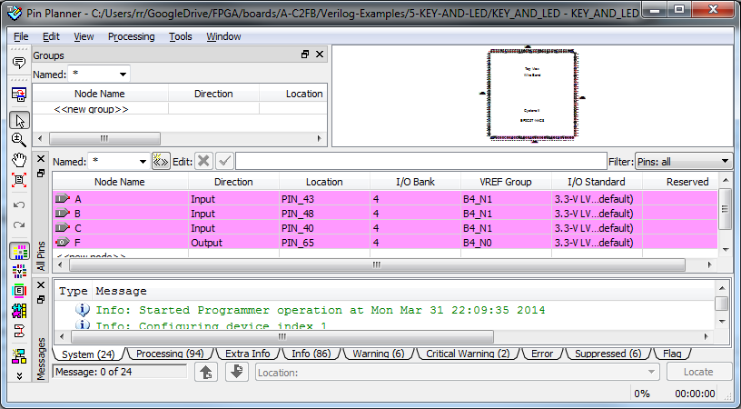

Straight forward. No crashing tonight.  Glass of stale cab sav - I wonder if that's what makes the difference??

module KEY\_AND\_LED ( A, B, F );

input A,B; output F; assign F = A & B;

endmodule

Nothing exciting here, no buttons then no lit LED, any or all buttons then LED lights.

So I bumped the inputs and played around with views.

module KEY\_AND\_LED ( A, B,C, F );

input A,B,C; output F; assign F = A & B & C;

endmodule

Becomes, in the RTL view:
[caption id="attachment\_994" align="aligncenter" width="450"] RTL view[/caption]
As you might expect, it thence becomes in the technology map view:
[caption id="attachment\_995" align="aligncenter" width="450"] Raw technology map view[/caption]
More interesting is:
[caption id="996" align="aligncenter" width="450"] Double click and hover over technology map view[/caption]
And finally, voila! it becomes:
[caption id="attachment\_997" align="aligncenter" width="450"] The raw gate from the chip planner view[/caption]
Of course, you can chase down the input/output pins as well:
[caption id="attachment\_1000" align="aligncenter" width="450"] PIN\_40 or input C[/caption]
[caption id="attachment\_1003" align="aligncenter" width="450"] The output pin[/caption]
To close the loop:
[caption id="attachment\_1001" align="aligncenter" width="450"] The "assignment"[/caption]
