Okay, so I thought I might toddle through the whole set of examples anyway to bed down some things and to not get too ahead of myself and ta da!
[caption id="attachment\_1024" align="aligncenter" width="450"][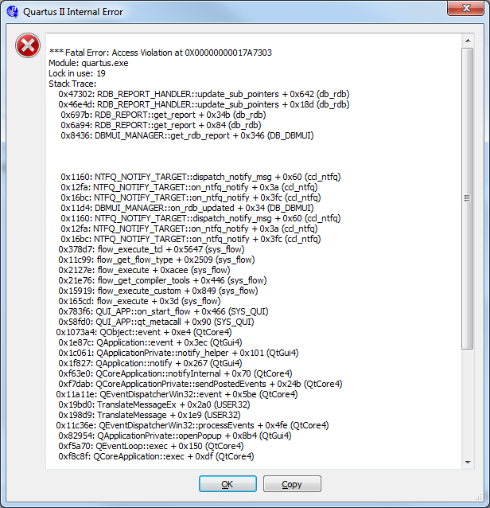](./exp6.png) Grrrr[/caption]
 
Basically went from:

module KEY\_NAND\_LED ( A,B,F );

input A,B;
output F;
assign F =~(A & B);

endmodule

to:

module KEY\_NAND\_LED ( A,B,C,D,F );

input A,B,C,D;
output F;
assign F =~(A & B & C & D);

endmodule

You know the drill by now.  Restart, take a swig of your drink and plod on.
Don't forget to update the pin assignment:
[caption id="attachment\_1025" align="aligncenter" width="450"][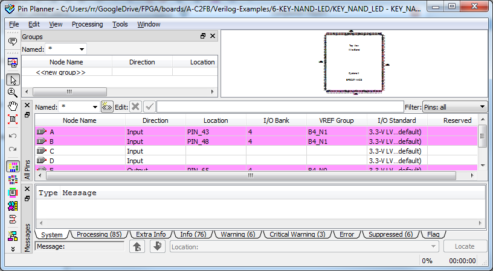](./exp61.png) Which pins? Hmmm[/caption]
 
From your spreadsheet DEV-PIN:

|  |  |  |
| --- | --- | --- |
| K3 | INPUT | PIN\_40 |
| K4 | INPUT | PIN\_45 |

So:
[caption id="attachment\_1026" align="aligncenter" width="450"][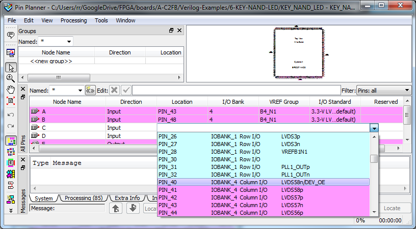](./exp62.png) Almost there...[/caption]
 
There we are:
[caption id="attachment\_1027" align="aligncenter" width="450"][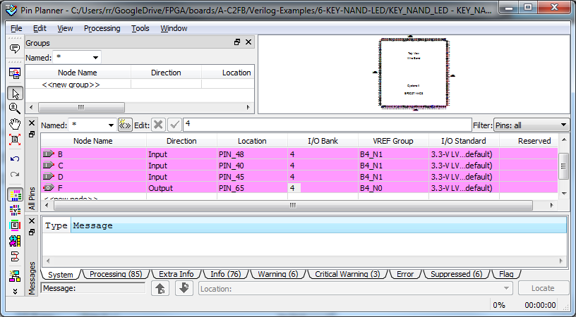](./exp63.png) Recompile for good measure.[/caption]
Program the chip and

|  |  |  |
| --- | --- | --- |
| D30 | OUTPUT | PIN\_65 |

Should be the LED lit and it will extinguish no matter which button or combination of buttons is pressed.
Now looking at the layout we see we are maxed out with our four inputs:
[caption id="attachment\_1028" align="aligncenter" width="450"][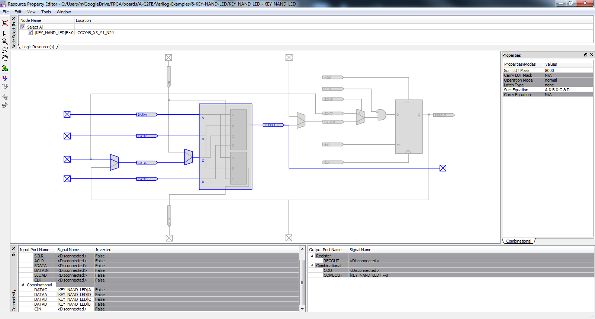](./exp64.png) I wonder ...[/caption]
So let's add a 5th and see what happens.  I am just grabbing:

|  |  |  |
| --- | --- | --- |
| LCD\_D0 | INOUT | PIN\_53 |

No reason, I want to see the layout change - not so interested in running it on the board.
Of course!
[caption id="attachment\_1029" align="aligncenter" width="450"][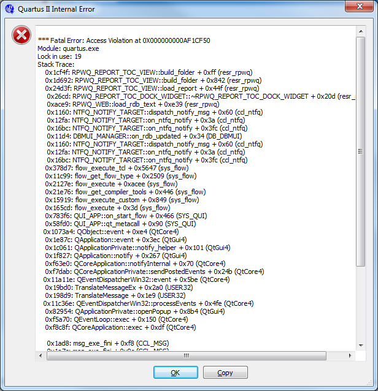](./exp65.png) Double grrrr![/caption]
Okay, so now two logic elements are being used.  Remember they cap inputs to four!
[caption id="attachment\_1030" align="aligncenter" width="450"][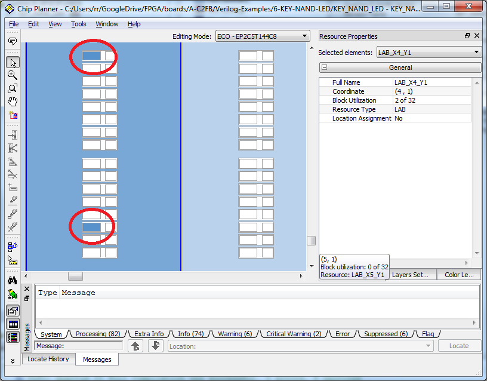](./exp66.png) Notice new cell at top.[/caption]
The bottom cell now looks like this:
[caption id="attachment\_1031" align="aligncenter" width="450"][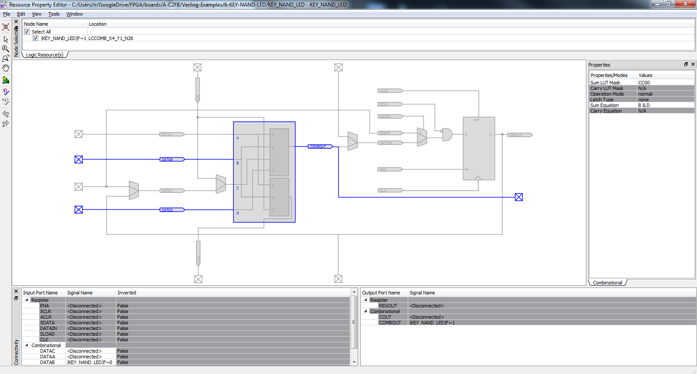](./exp67.png) Only two????[/caption]
The top cell has four inputs (like the original one).
Looking closer:
[caption id="attachment\_1032" align="aligncenter" width="450"][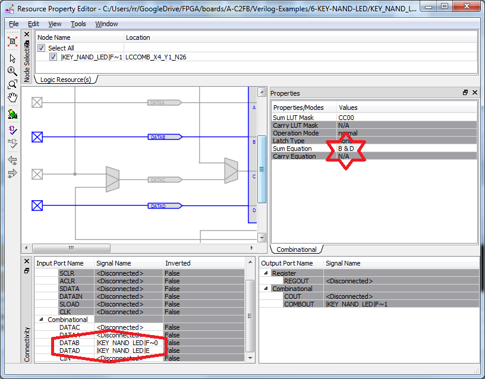](./exp68.png) What's in a name?[/caption]
In the red star is the "Sum Equation" for the gate.  It is "B & D".  These are actually the input names for the data inputs to the logic element.  Notice in the red hexagon DATAB < F~0 and DATAD<E.  The "F" and the "E" relate to the output and one of the inputs of our modified verilog module.
Essentially, as the logic cells are capped at four inputs it has split the design into two logic elements, one with inputs A,B,C,D.  One is the output of A&B&C&D=F and the second is E&F~0=F(F~0 is just a clumsy way of having an intermediate result).
If you believe the RTL viewer it is:
[caption id="attachment\_1034" align="aligncenter" width="450"][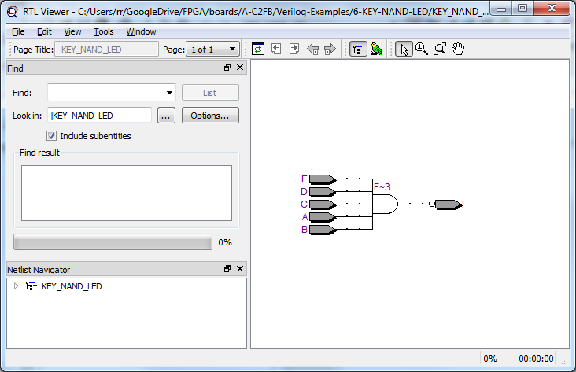](./exp610.png) Nice but not really true.[/caption]
In schematic speak its more likely:
[caption id="attachment\_1033" align="aligncenter" width="450"][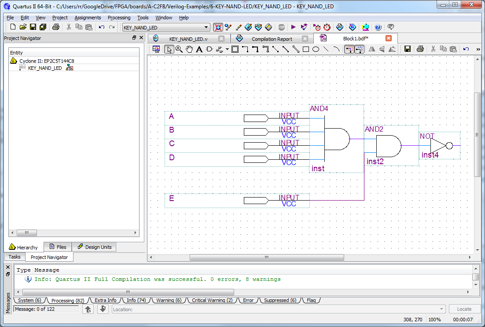](./exp69.png) and4&and2&or[/caption]
 
Which matches, more or less, the technology map view:
[caption id="attachment\_1038" align="aligncenter" width="450"][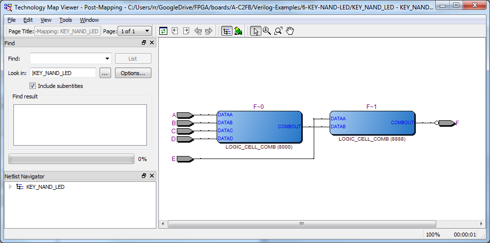](./exp612.png) Ah ha![/caption]
So the coup de grace is the not gate is sitting on the output pin circuit, voila!
[caption id="attachment\_1039" align="aligncenter" width="450"][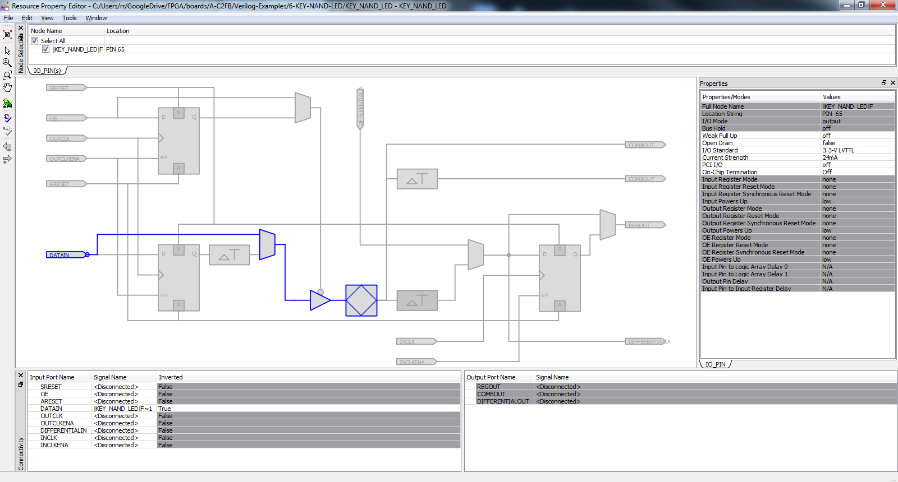](./exp613.png) The final piece of the puzzle.[/caption]
