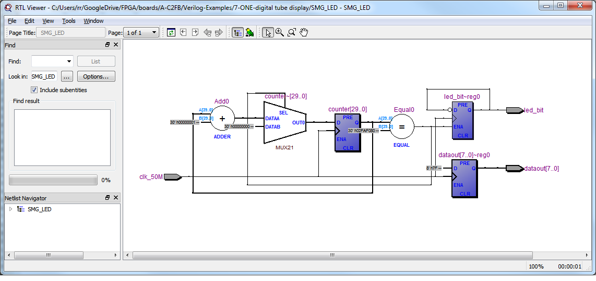

Okay, so we talked about [blinking the 7\_Segment display](http://organicmonkeymotion.wordpress.com/2014/04/04/cyclone-ii-exp-7/ "Cyclone II-Exp.7").
Now we can look ahead at some of the other examples but I thought it instructive to try with the current example and a search of the interwebything for some ideas so I went for dividing the clock input with a 30bit divider - mostly so I could tune the rate.
50MHz is 26'b10111110101111000010000000 so will happily fit into 30bits to give us slower that 1hz rates if we want.
So the code, if you're curious, is [here](http://organicmonkeymotion.wordpress.com/wp-content/uploads/2014/04/blinkingdp.png "Get ahead of the tutorials.") (it is a png file to make you type it you lazy sod).  It basically divides 50M by 50M to give a 1second blink.
Change the value:

dataout<=8'b01111111;

... to get different segments blinking together.
The other thing to do would be to set a bit and then shift it each time to blink alternate segments.  This is again an exercise later with the individual LED.
Alternatively, you can hold on for Exp.15.
Of course, the thing to note, there are gaps in the exercises that come with the board and no tutorial material to read to cover the gaps.  I suspect there is something out there, I am looking but if anyone has come across the supporting material do pipe up.
In any event, the RTL  view provides the sanest view of the result:
[caption id="attachment\_1072" align="aligncenter" width="450"] Yeah, I get that.[/caption]
 
