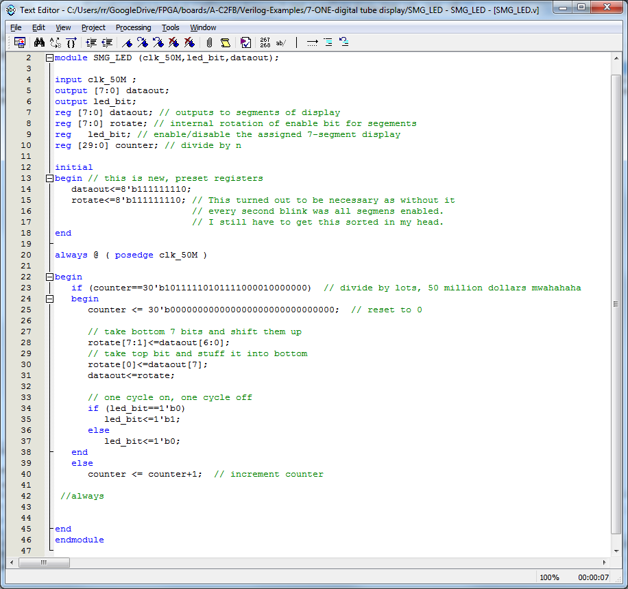
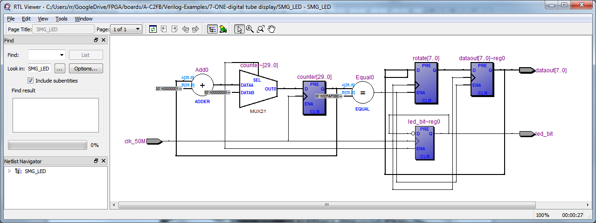

Okay, I couldn't help myself, [let's shift the enabled segment](http://organicmonkeymotion.wordpress.com/2014/04/05/cyclone-ii-exp-7-cont-d/ "Cyclone II-Exp.7 – follow up").
Without looking ahead and doing some interwebything searching and head scratching:
[caption id="attachment\_1075" align="aligncenter" width="450"] Rotate around the segment enable[/caption]
https://www.youtube.com/watch?v=zEYv9YVqHME&feature=youtu.be
The exercise for the reader is to take this example, expand the LED enable to a shifting register and rotate through each segment of each 7-segment display.
RTL for this looks like:
[caption id="attachment\_1084" align="aligncenter" width="450"] Rotating of enabled segment with additional register.[/caption]
... rather than the preceding one [without the rotating enable](http://organicmonkeymotion.wordpress.com/wp-content/uploads/2014/04/exp74.png "Previous version").
The main difference is the presetting of the first one we tackled versus the rotation through the register in the one in the picture above.
