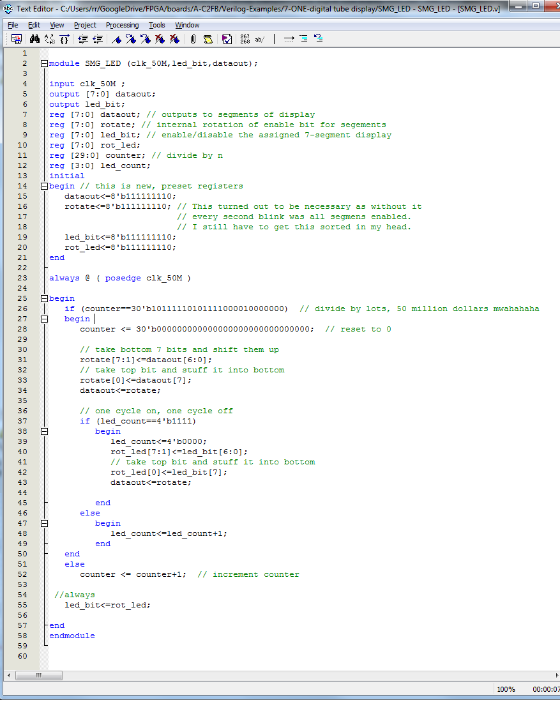
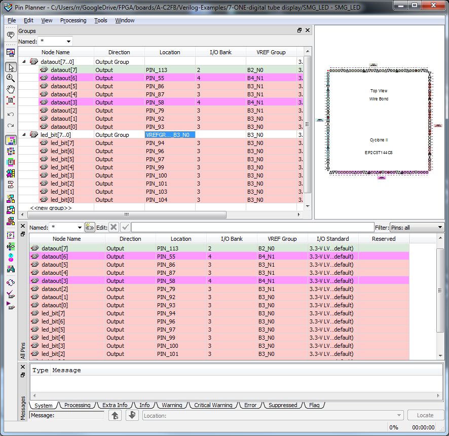
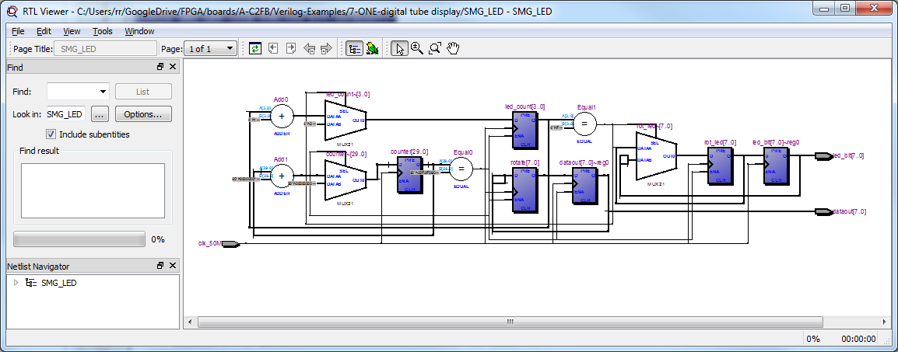
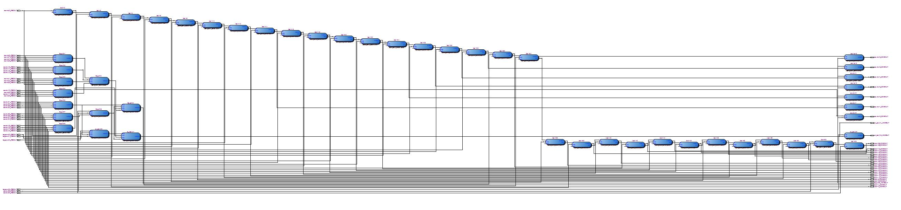

Cyclone II-Exp.7 – parts [1](http://organicmonkeymotion.wordpress.com/2014/04/04/cyclone-ii-exp-7/ "Cyclone II-Exp.7"), [2](http://organicmonkeymotion.wordpress.com/2014/04/05/cyclone-ii-exp-7-cont-d/ "Cyclone II-Exp.7 – follow up"), [3](http://organicmonkeymotion.wordpress.com/2014/04/05/cyclone-ii-exp-7-follow-up-follow-up/ "Cyclone II-Exp.7 – follow up, follow up"), and 4.
[caption id="attachment\_1088" align="aligncenter" width="450"] The final straw.[/caption]
Now the code can be modularised in places, especially around the register rotation ... ... but I think we've had enough fun with these and we can move on.
Note that we have a 4 bit or 16 count cycle for the led display enable cycle because there are 7-segments +plus 1 decimal place (that's 8) ;and each LED (segment and DP) is turned on for a second and off for a second.  Therefore (7+1)\*2=16.
The other thing will be, when you compile, a bunch of errors will occur first up because the pin allocation is not correct ... yet.  Just go into the "Pin Allocation" dialog. Use, of course:

|  |  |  |
| --- | --- | --- |
| LED\_EN1 | OUTPUT | PIN\_94 |
| LED\_EN2 | OUTPUT | PIN\_96 |
| LED\_EN3 | OUTPUT | PIN\_97 |
| LED\_EN4 | OUTPUT | PIN\_99 |
| LED\_EN5 | OUTPUT | PIN\_100 |
| LED\_EN6 | OUTPUT | PIN\_101 |
| LED\_EN7 | OUTPUT | PIN\_103 |
| LED\_EN8 | OUTPUT | PIN\_104 |

Take note, I could not get the tool to accept the NULL or empty entry for the "led\_bit" group - so I thought it safe to set it to the group the pins sat in, seemed to work. However, I do note that the "Output Group" of the "dataout" group was not set - this was part of the original project.  It is likely a sequence thing, who knows??  Just another thing to chase down in background.
 
[caption id="attachment\_1096" align="aligncenter" width="450"] Apply grouped pins.[/caption]
It does seem that it was a problem caused because we changed the OUTPUT from a single bit reg to an 8 bit reg and the various tool bits had or are not synchronised.  No problem, a few twiddles and it works.
http://www.youtube.com/watch?v=pZ\_woSD1O7Y
RTL for this verilog looks like this:
[caption id="attachment\_1106" align="aligncenter" width="450"] Voila![/caption]
And the Technology Map Viewer:
[caption id="attachment\_1107" align="aligncenter" width="450"] Busy, busy, busy[/caption]
 
