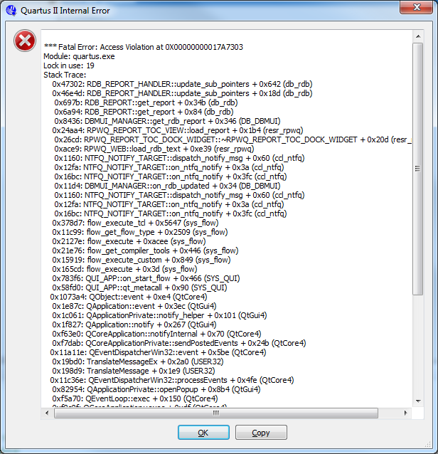
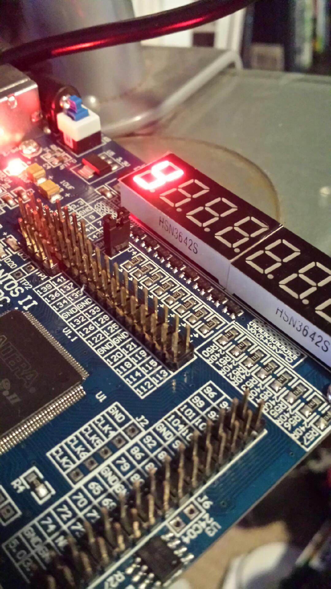
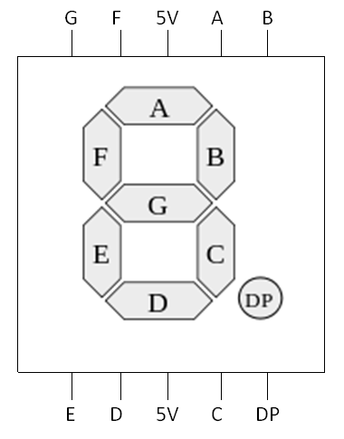
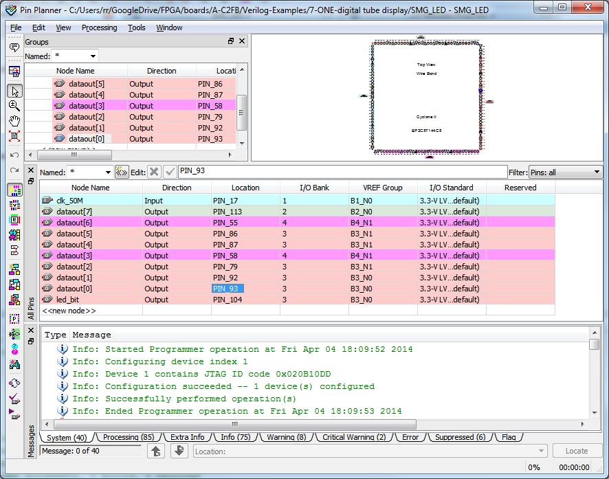
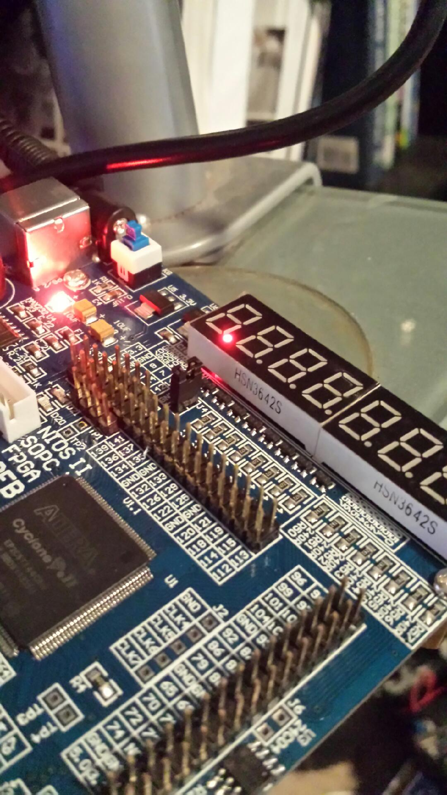

Okay, so this one comes with some commented out code:

module SMG\_LED (led\_bit,dataout);

// input clk\_50M ;
output [7:0] dataout;
output led\_bit;

reg [7:0] dataout;
reg led\_bit;

//always @ ( posedge clk\_50M )

//begin

always led\_bit <= 'b0;

always dataout<=8'b11000000;

// end

endmodule

Nothing special here.  Code compiles and the number "9" lights up in a 7-segment LED.
Going to the pin assignments (open up the pin assignments now) you can see the allocation to:

|  |  |  |
| --- | --- | --- |
| LED\_A | OUTPUT | PIN\_93 |
| LED\_B | OUTPUT | PIN\_92 |
| LED\_C | OUTPUT | PIN\_87 |
| LED\_D | OUTPUT | PIN\_86 |
| LED\_E | OUTPUT | PIN\_55 |
| LED\_F | OUTPUT | PIN\_58 |
| LED\_G | OUTPUT | PIN\_79 |
| LED\_H | OUTPUT | PIN\_113 |

Which are the 7-segments and the decimal place.
The other stray is:

|  |  |  |
| --- | --- | --- |
| LED\_EN1 | OUTPUT | PIN\_94 |

Which is why we've lit up the last 7-segment display on the right.
Change to:

|  |  |  |
| --- | --- | --- |
| LED\_EN8 | OUTPUT | PIN\_104 |

Recompile and voila!
First 7-segment LED on left should be lit up.
Change the line:

always led\_bit <= 'b0;

to:

always led\_bit <= 'b1;

and get:
 
[caption id="attachment\_1046" align="aligncenter" width="450"] Ignore this.[/caption]
What you actually get is you've turned off the 7-segment display.  That is nothing is lit.
That is the "EN" is, you guessed it, ENABLE and "0" is ENABLED and "1" is DISABLED.
 
All good.
 
Change the line:

always led\_bit <= 'b1;

back to:

always led\_bit <= 'b0;

 
Then change:

always dataout<=8'b11000000;

to:

always dataout<=8'b11000001;

 and get:
[caption id="attachment\_1047" align="aligncenter" width="450"] "Missing" segment.[/caption]
 
So, going from a 7-segment map, this is segment A:
[caption id="attachment\_1059" align="aligncenter" width="380"] ABCDEF G, no KY[/caption]
Have a look at the pin allocation vs the pin map for the board:
[caption id="attachment\_1060" align="aligncenter" width="450"] Not 42 but 42\*2+9[/caption]

|  |  |
| --- | --- |
| LED\_A | PIN\_93 |
| LED\_B | PIN\_92 |
| LED\_C | PIN\_87 |
| LED\_D | PIN\_86 |
| LED\_E | PIN\_55 |
| LED\_F | PIN\_58 |
| LED\_G | PIN\_79 |
| LED\_H | PIN\_113 |

 
Even better try:

always dataout<=8'b01111111;

and get:
[caption id="attachment\_1048" align="aligncenter" width="450"] D D D D Decimal place![/caption]
Without point too fine a point on it, of all the LED\_x ...

|  |  |  |
| --- | --- | --- |
| LED\_H | OUTPUT | PIN\_113 |

... is the decimal place yes!
Remember, we set the enable to first 7-segment LED with:

|  |  |  |
| --- | --- | --- |
| LED\_EN8 | OUTPUT | PIN\_104 |

Try different values, just walk through B, C, D, etc.

### //Commented out code

So, the code that is commented out.
Play around with it to get it to work.  Answer is [here](http://organicmonkeymotion.wordpress.com/wp-content/uploads/2014/04/exp71.png "Not 42!").
Now for this to work you have to assign another pin.  The pin name in the code helps as it refers to a pin in the DEV-PIN spreadsheet, namely:

|  |  |  |
| --- | --- | --- |
| CLK\_50M | INPUT | PIN\_17 |

 
Compile and run it and ...
... "9" appears on right (if we start with original code and simply un-comment lines).
So, assuming we have a 50 megahertz signal (50M) running internally, driving the enable we are very likely not to see any flickering etc. that you might expect with a much slower clocking of the enable.  Which gives a hint that if we want to see blinking, we might need to divide down the 50M clock input somewhat.
Not this time around.  Look on the interwebything.  There will be Verilog code examples for dividing circuits.
