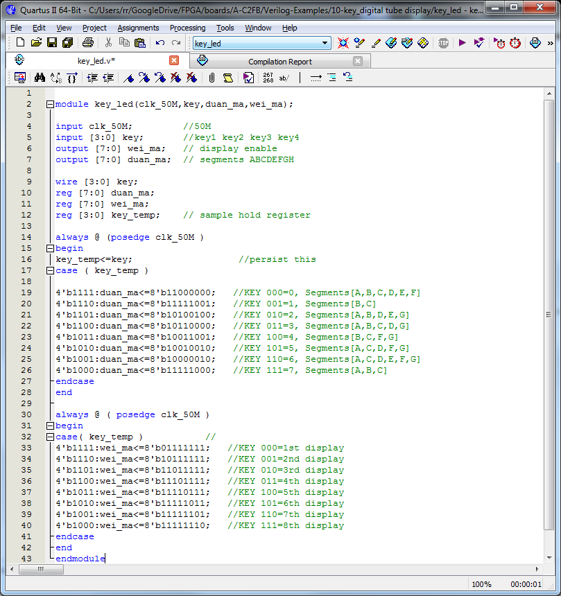

Okay, so a quick break from study and voila!!
[caption id="attachment\_1173" align="aligncenter" width="240"] Seemple \*tick\*.[/caption]
Simple mod to experiment first.
Instead of matching button to display and displaying button number on display we enter 3-bit binary to get decimal on the display indexed by the binary - zero equals first display, 7 equals eighth display.
[caption id="attachment\_1167" align="aligncenter" width="450"] Binary to decimal to display[/caption]
 
The binary code is input by the first three buttons.
Zero is displayed on first display when no buttons are pushed.
No button pushed then input is pulled high, button pushed takes input low (which explains the logic).
3-bit binary code is decoded into decimal on the display indexed by the same binary code.
