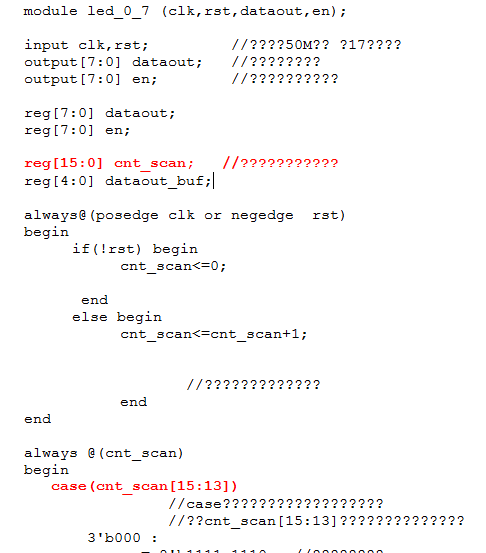
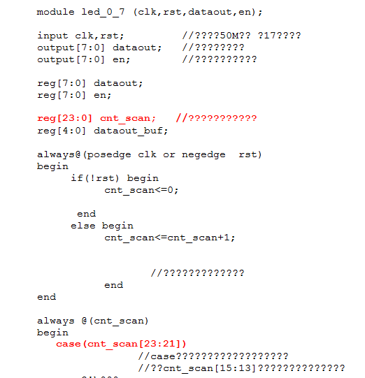

I skipped through a couple of the other examples for the board and they were naff (niff naff and trivia).
I jumped straight to the 2nd last one and it puzzled me a little so we'll go over that one - I think we need to start stretching ourselves somewhat after this one.
[caption id="attachment\_1190" align="aligncenter" width="450"] 2nd last example that came with board[/caption]
 
With example "20-digital tube display-0-7" two lines are important for your understanding of the code.
When compiled and run what you get is all 8 displays lit with numbers 0..7 on display.
Reading into the code it is actually cycling the display enables and also presenting the segment enables to each display as it is enabled.
So, each display is flashed thence onto the next.  Too fast for the eye to discern.
To better see what is happening change the code to the following:
[caption id="attachment\_1191" align="aligncenter" width="450"] Bigger counter, slower count(down)[/caption]
Result as follows:
http://youtu.be/yCi-SGqlWYg
Of course, you can slow it down further with [31:o] and [31:29] respectively ... but that will be  r.e..a...l   s...l......o............w!
[caption id="attachment\_1198" align="aligncenter" width="199"] TOO FAST!![/caption]
