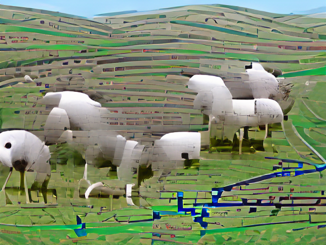

Here is a joke that is used to explain Defeasible Reasoning:

During a train trip through the countryside, an engineer, a physicist, and a mathematician observe a flock of sheep. The engineer remarks, "I see that the sheep in this region are white." The physicist offers a correction, "*Some* sheep in this region are white." And the mathematician responds, "In this region there exist sheep that are white on at least one side."

Here is the resulting AI generated picture
