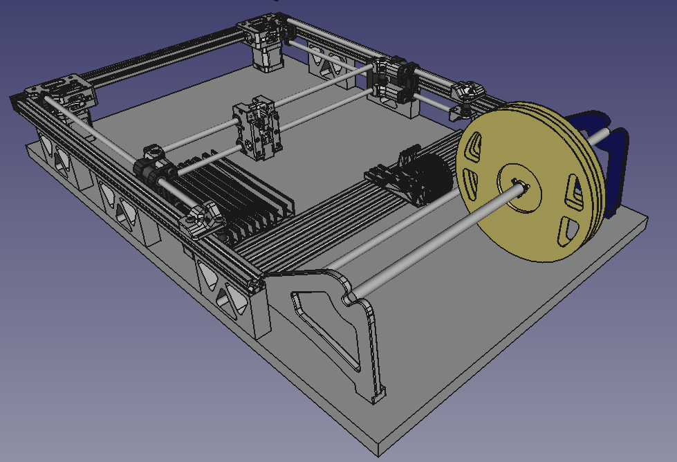
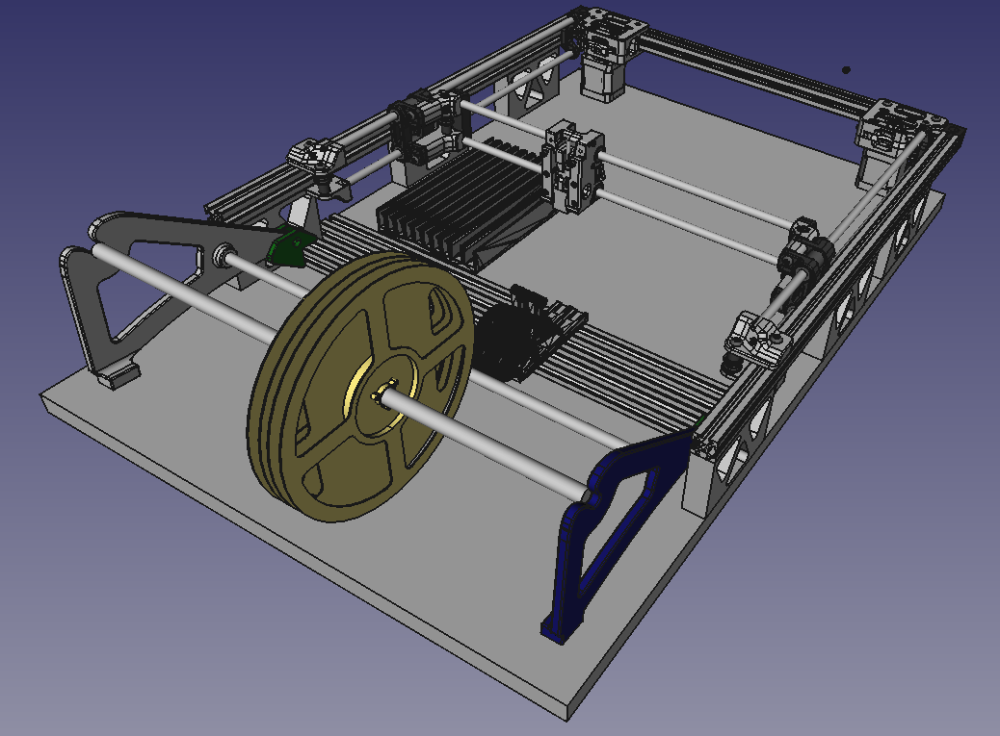

Alright. So, the price aspect didn't make sense in the full frame design, if'n you want a budget model.

So, Figure 1 and Figure 2 is the budget model (from two different angles).

Everything is borrowed from other designs (thanks all), except for the stanchion's the 2020 extrusions are sitting on.

So, between Figure 1 and Figure 2 a very economic PnP with a 310x310 work area for small runs is born.

Once I have finalised the stanchion design, I'll pop it into Thingiverse.

Figure 1

Figure 2

This is then, more or less, reminiscent of the [manual PnP](https://organicmonkeymotion.wordpress.com/2021/03/02/picky-picky-picky/) I built, am still experimenting with feed upgrades. The tape spool and the pair of parallel 2020 sections the feeders sit upon are both from that idea.
