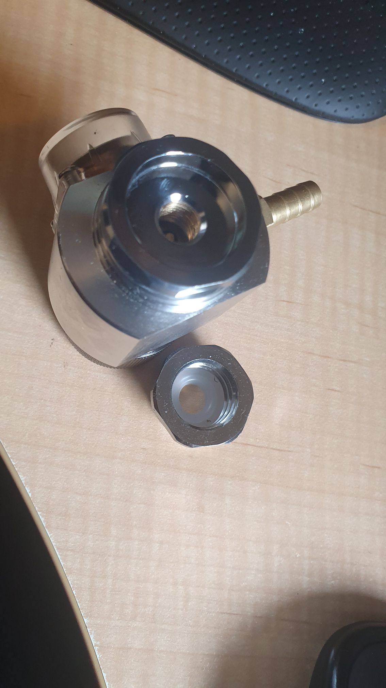

I grabbed a couple of old spent Sodastream bottles, mitt the last skerrick of gas in'm.

Sure enough, the new joiner (female W21.8-14 to male T21-4) fitted the original adapter in the regulator from Aliexprss, as what was in the regulator was a T21-4 female thread. The Sodastream bottle did in fact have a male W21.8-14 thread and it screwed on fine into the female W21.8-14 female thread in the adapter.

There is a bit of a question about order of insertion, and I bottomed out with attach adapter to bottle first.

However, when I thread the male T21-4 into the regulator, while it seats fine, it seems the internal valve seat is too far away from the "pin" in the regulator to trip the valve to let air through.

I assume it would be fine with a sodastream bottle with a T21-4 thread, but it will not actually work with the regulator I am using.

FRAAAAACK!

So, option now is grab a few 16gm cartridges to see if that option will work with the alternate adaptor I got in from California no less.

Go figure I can get a 74gm adapter from a [brewing supply in AUS](https://kegland.com.au/products/mini-core-360-adaptor-for-74gram-cartridge-bulb-g1-2-male-x-5-8-18unf-female?_pos=12&_sid=68fee563c&_ss=r), though it may be threaded for their regulators. We'll see. It's on its way.
