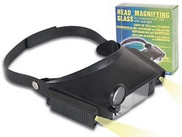
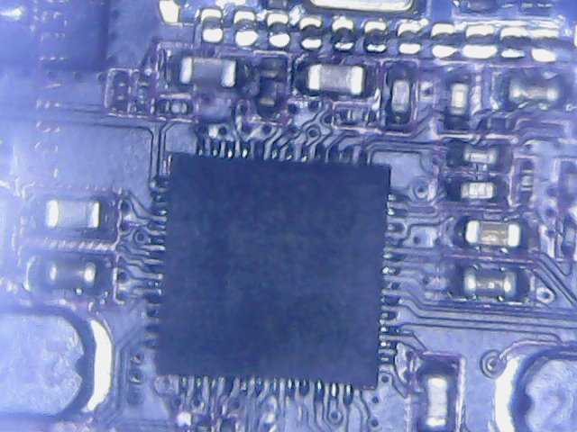
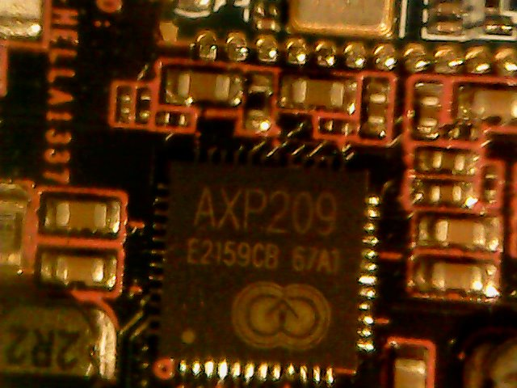

Have poor eyes nowadaze.  So I have a few gadgets to help out.  I have a large plastic fresnel lens, a jeweler's monocle, a hands free mag glass with light, namely:

Most have limitations and I am happy enough that they work within those limitations.
Still, I was looking forward to my [USB Microscope](https://www.aliexpress.com/item/Practical-Electronics-5MP-USB-8-LED-Digital-Camera-Microscope-Endoscope-Magnifier-50X-500X-Magnification-Measure-free/32614372567.html?spm=a2g0s.9042311.0.0.ZiJsN2).  Only $20 etc. so not expecting much but frack me!
The one that turned up seemed fine.  However, I was dazzled somewhat by the brightness of the LED.  There is an adjustment but, via the viewport, you have pitch black or you flood the viewing field.
The software that comes with it installs BUT the purposed software for the microscope (that includes allowing changing of resolution) installs but does not run on Windoze.  There is a second piece of software (AmCap) that I suspect is a open source program.  It runs fine but does not offer any more functionality than the camera app that comes with Windows 10.  Turns out good old MyCam works a treat with the resolution setting so you don't need to install anything from the vendor disk.
Functions okay.  Lighting problem disappointing.  I am only using it for fine PCB work anyway so likely not a problem, and it was only $20.
[caption id="attachment\_4843" align="aligncenter" width="450"] View flooded by bright LED array supplied inbuilt[/caption]
[caption id="attachment\_4844" align="aligncenter" width="450"] Using a warm, slimline, LED desk lamp[/caption]
