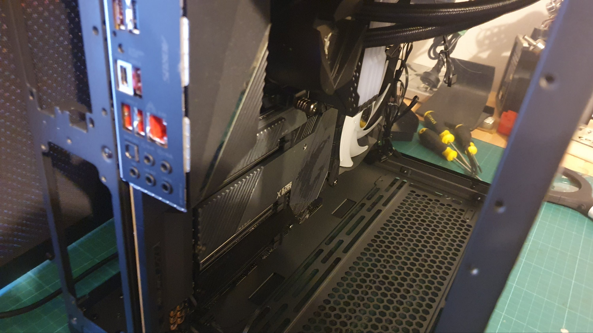

Got to here with my Monsta PC build.





Mobo and cooler in.


I opted to put them in to get them off me desk. To protect them. As I have to take a pause on the build, so unlike me.


To wait for the PSU to turn up.


An SFX size PSU.


Not, I say not the ATX PSU that I did buy for the build.


[](./doh.png)


You can see the empty PSU position?! Taunting me?!


If anyone cares, there's a cheap ATX 850W Corsair RM850x on Ebay. Unopenned box etc.


[](./whaaaaatttt-tha.png)


Build was:


```
- AMD Ryzen 9 5950X 16-Core AM4 3.40 GHz Unlocked CPU Processor
- Gigabyte X570S AORUS PRO AX AM4 ATX Motherboard – Rev 1.1
- NY GeForce RTX 4080 XLR8 Gaming VERTO EPIC-X RGB OC 16GB Video Card
- 4 sticks of Corsair Vengeance RGB PRO 32GB DDR4 3200MHz Memory
- MSI MAG CORELIQUID 280R Liquid CPU Cooler
- 6x Thermaltake Pure 12 120mm ARGB TT Premium Fans
- 2x 2TB SDD, Samsung 970 EVO Plus 2TB NVMe 1.3 M.2 (2280) 3-Bit V-NAND SSD
- Corsair RM850x 2021 850W 80 Plus Gold Fully Modular ATX Power Supply
- Lian Li PC-O11 Dynamic Tempered Glass Mini Tower Case – Black
```


Build now will be:


```
- AMD Ryzen 9 5950X 16-Core AM4 3.40 GHz Unlocked CPU Processor
- Gigabyte X570S AORUS PRO AX AM4 ATX Motherboard – Rev 1.1
- NY GeForce RTX 4080 XLR8 Gaming VERTO EPIC-X RGB OC 16GB Video Card
- 4 sticks of Corsair Vengeance RGB PRO 32GB DDR4 3200MHz Memory
- MSI MAG CORELIQUID 280R Liquid CPU Cooler
- 6x Thermaltake Pure 12 120mm ARGB TT Premium Fans
- 3x 2TB SDD, Samsung 970 EVO Plus 2TB NVMe 1.3 M.2 (2280) 3-Bit V-NAND SSD
- Corsair SF850L 850W 80+ Gold Fully Modular PCIe 5.0 ATX 3.0 SFX-L Power Supply
- Lian Li PC-O11 Dynamic Tempered Glass Mini Tower Case – Black
```


https://www.youtube.com/watch?v=FDb3D3uIl0g


RBD LED management


Oh dear, it also occured to me that as I'll be running Debian (or at least that's the plan) the iCUE software won't be available, for my Corsair Vengeance RGB PRO light control, since ICUE runs on Windoze.


Not a problem apparently as someone has already crafted OS agnostic code.


https://openrgb.org/


https://gitlab.com/CalcProgrammer1/OpenRGB/-/releases
