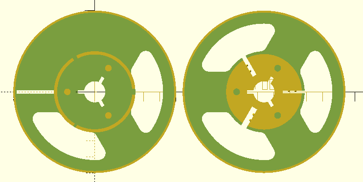
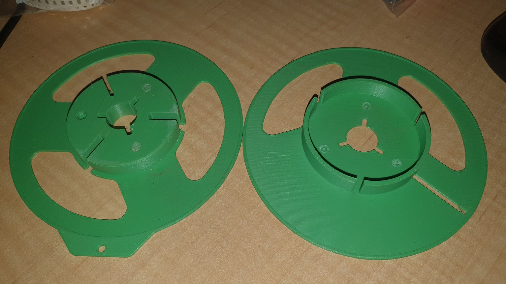
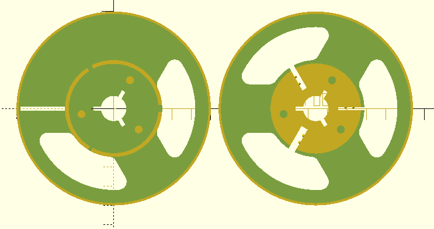
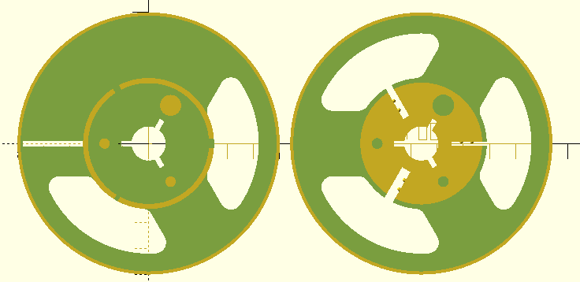
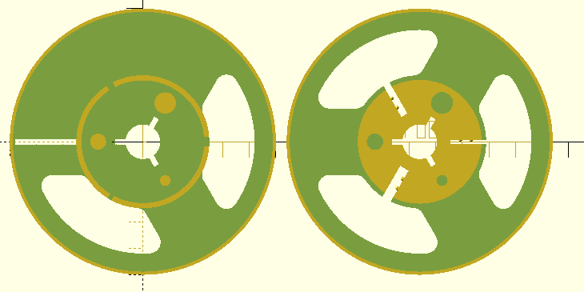
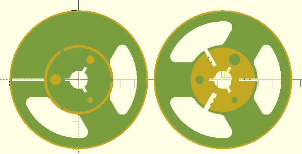

So, the two reel halves have "alignment pins".

Fantastic, except, there are three slots to hold down ends of tape. Each of a different thickness to accommodate different thickness in tape.

Because the alignment pins are all 120 degrees apart, you have, as I did, the problem of misalignment. Since you can rotate the halves and misalign on 2 of the 3 optional positions.

Figure 1

Side effect, if you try to prise the two sides apart, so you can realign the sides, you get pins broken off in holes per Figure 2.

Figure 2

I found this out the hard way, as I printed two sets of reel halves. One went together "align", pure arse luck, since I didn't think it through. And the second, annoyingly "misaligned". I thought to gently prize the two halves apart, using a spatular, but the pins broke off. No biggy, a dab of Tarzan's Grip'll fix this one. But I am sufficiently bugged by this to have a look at changing the code, so the alignment pins are acutally alignment pins.

What also seems fun is the OpenSCAD file does not mirror the two halves. So doing something like offsetting 2 of the three pins "works", in so far as the pins are concerned. Unfortunately, just hacking the code as it stands also does no mirror the results. You can see the difference between Figure 1 and Figure 3, with Figure 3 representing 2nd and 3rd pin offset 10 and 20 degrees. Notice, however, the locations of the three slots.

Figure 3

Rather than going the long way, and trying to set up the mirroring of the parts. I had a idea about making one pin fatter, so Figure 4.

Figure 4

Brilliant right ! Except, notice the top/bottom connundrum. On one the fat pin is between the 1st and 2nd thickest slot. On the other the fat pin is between the 2nd and 3rd thickest slot. So, the "side" needs also to select the fat pin location. Makes sense I adjust one of the sides. At the moment the fat pin is at idx==0.

To help visualise this I changed the code to have 3 different post thicknesses in Figure 5. Makes it easier to spot which idx is which pin. In Figure 5 it goes idx==0==2\*diam, idx==1==1.5\*diam, and idx==2==1\*diam.

Figure 5

|  |  |  |  |  |  |  |  |
| --- | --- | --- | --- | --- | --- | --- | --- |
|  | thinest slot |  | second thinest slot |  | thickest slot |  | thinest slot |
| Left image |  | idx==1 |  | idx==0 |  | idx==2 |  |
| Right image |  | idx==0 |  | idx==1 |  | idx==2 |  |

Table 1

Per Table 1, I should be able to hack this by swapping idx 0 and 1 values dependant upon "top"/"bottom" flag. So, with a little hack, we get Figure 6. With a cross check at Table 2.

|  |  |  |  |  |  |  |  |
| --- | --- | --- | --- | --- | --- | --- | --- |
|  | thinest slot |  | second thinest slot |  | thickest slot |  | thinest slot |
| Left image |  | idx==0 |  | idx==1 |  | idx==2 |  |
| Right image |  | idx==0 |  | idx==1 |  | idx==2 |  |

Table 2

What? It unbalances the Feng Shui? Why? Oh, the fat pin is opposite the fat slot, but the other two pins are not matching pin fatness with slot fatness. Hmm, might make sense to fiddle with that, but only for the sake of Art.
