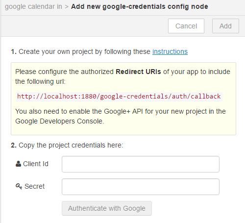
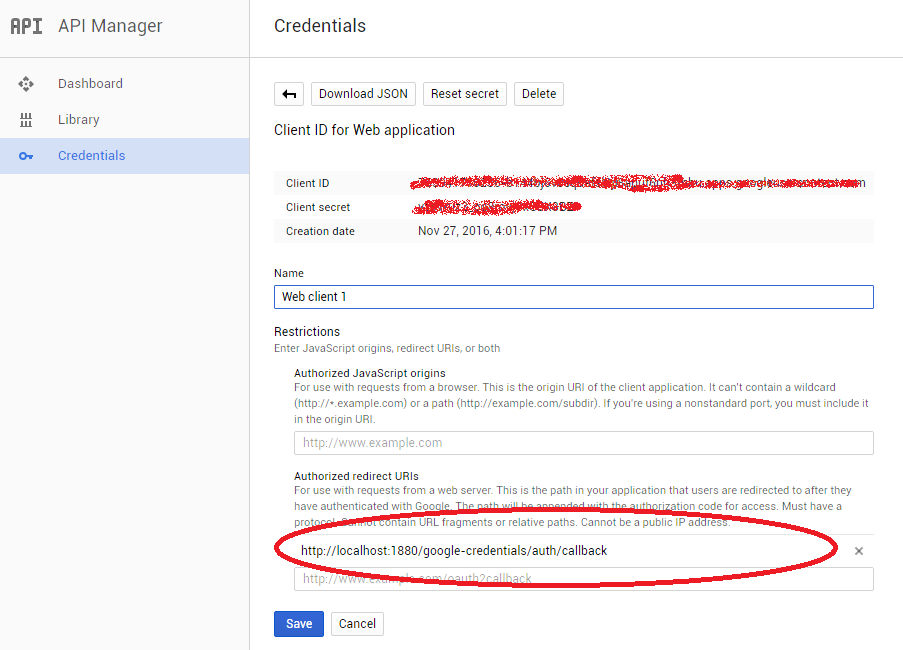
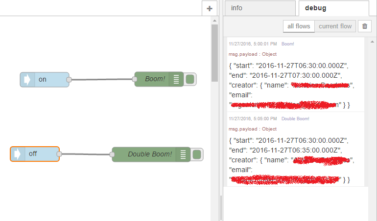

So, I ripped out node-red from my PC and re-installed.  I then re-added node-red-node-google.
Now the behaviour of google nodes in the PC variant was different to the google nodes on TheThingBox.  When I went to the properties of the PC variation I got the following:

So it turns out you clip the redirect URI into the google api credentials info:
And voila!

Two events from google calendar, one at start of event and the other at the end.  So good enough to turn sprinklers on and off.  Yes, I just set up a calendar on google called "sprinkler" - too easy.
Doesn't help, though, getting the RaspingBreathBurry going.  But may mean I need build node-red onto the RaspingBreathBurry and avoid TheThingBox install.  The problem is either they "adjusted" it for TheThingBox as an app OR it's broken.  Either way, if I can't connect readily to the google calendar then too much code need be written.
Now, spread out over internet is the problem of which api to enable.  The [guidance](http://flows.nodered.org/node/node-red-node-google) says "Directions API" which doesn't make sense for Calender events.  All forms of dribbling all over the place.    Turns out you want to enable Calendar and Google+.  Not even sure that you really need Google+ for calendar things but it is enabled.
Niggly I know but courtesy would be to just list the api required and the steps to boot.   This "you are stupid if you can't work things out" bullshit of opensource flies in the face of application of learning theory from educational science.   I guess it is also a passive form of bullying by anti-social gimps.
