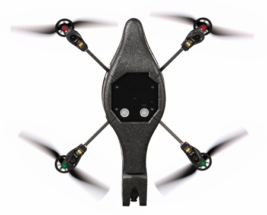

How did that escape me!
I just remembered.  The AR-Drone has a down looking camera that will also be a target of omni-directional obstacle avoidance.

[](http://organicmonkeymotion.wordpress.com/wp-content/uploads/2011/12/44576hiparrot_ardrone_08.jpg)

There has been some work building the ARDrone with OpenCV so some smoothing of the way.  Interestingly, mostexperiments have been using Optical Flow as an avoidance scheme, using the front camera - rather than what is ostensibly a simpler approach with a little hardware hack and gentler software.
PS [a little hand is at ...](http://www.flong.com/blog/2010/open-source-panoramic-video-bloggie-openframeworks-processing/ "Sometimes I love the Net...")
