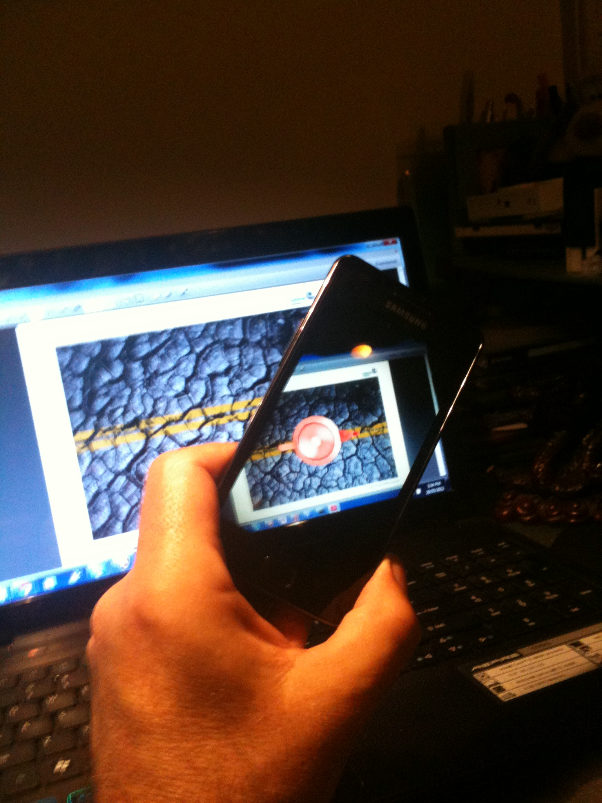

So,  doodles to date:

* Buzzed out NDK and tested with a couple of sample apps.  Seems to work fine on IDEOS, Samsung phone and ACER tablet.
* Buzzed out OpenCV for Android with a couple of sample apps.  Doesn't work with IDEOS (needs debugging still) but works with Samsung phone and ACER tablet.
* Buzzed out the AR toolset from QualComm.  As it is targeting later Snapdragon chipsets I have tried running the ImageTargets demo on the Samsung and works a treat.  However, I had to build it for Android 2.2 because under 4.03 the build balked because of deprecated calls.  That probably wasn't stopping the build produce the apk file but to-be-sure-to-be-sure I backed down to 2.2.  Turns out, no need to print the target images, the pdf open on my laptop was good-n-nuff for the samsung to display the teapot.

