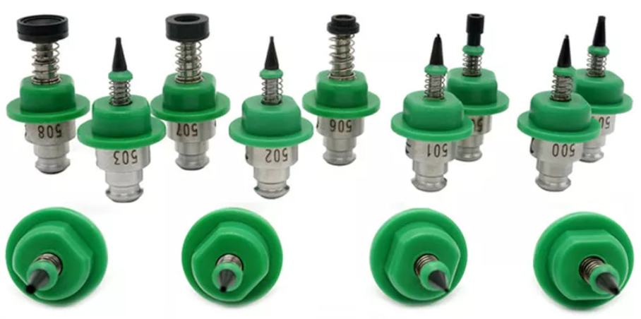
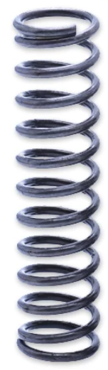

So, back onto the [manual pnp project](https://organicmonkeymotion.wordpress.com/2021/03/02/picky-picky-picky/) with a report there are dribbling in some of the final purchases, including:

Nozzles: 506, 504 and 503

Pneumatic Switch

Spring for returning the pnp head

Still a few fiddly bits to come. I will set up and do a print run of the 3D printed parts once I get more of the hardware in, and probably as a batch along with the re-print of the Bear.

Full BOM, of course, is [here](https://www.thingiverse.com/thing:3644398).
