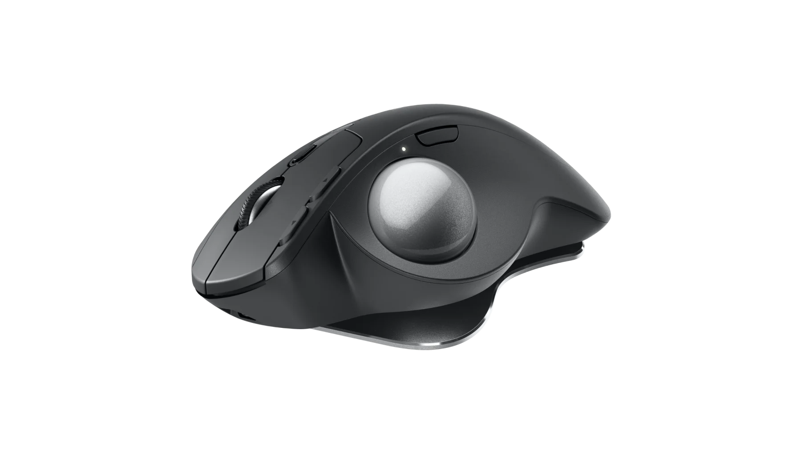

Seriously, I spilled a protein shake at my desk, over a few things including me old mouse.

Finished off the mouse when I dropped it into the bowel of water I was using to clean the mess up.

Gold really.

I was looking at something more conjucive to my needs for 3D work in FreeCAD and Blender.

So, ... , I have to now recommend the Logitech MX Ergo S! Way kool! Way comfortable!

Really useful, it can connect to either of two computers. So I have it connected to my MonstaPC and me trusty old HP Spectre 360x laptop.
