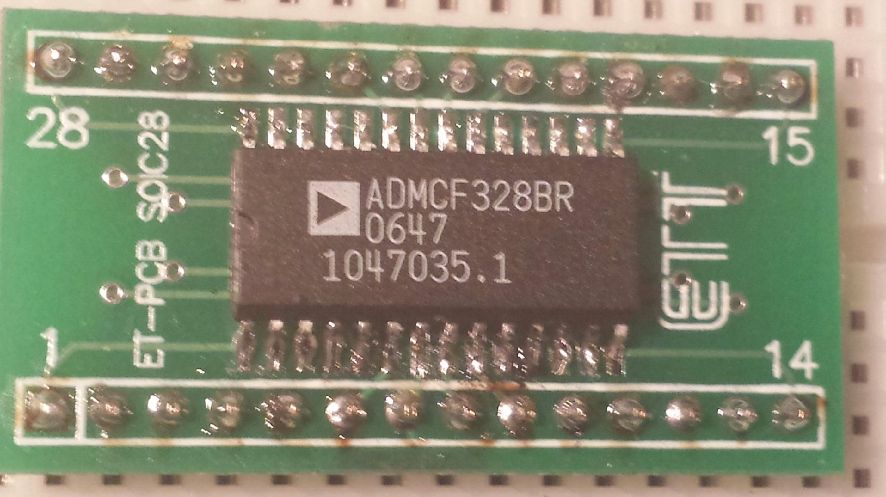

Author/lecturer has made his text on digital signal processing available online [here](http://eceweb1.rutgers.edu/~orfanidi/intro2sp "Very good, well tested against students").
The wild thing, he has a [lab book based on the ADSP 2181 EZKIT LITE](http://www.ece.rutgers.edu/~orfanidi/ezkitl/man.pdf "What are the chances?"), aka:
[caption id="attachment\_1374" align="aligncenter" width="300"] ADSP 2181 EZ-LITE[/caption]
I am so rusty after a decade or more so this is perfect.
Also wik, I got a half dozen SOIC28 to DIP28 breakouts and worked out my soldering is out of practice, my $400 prescription glasses are no good for close work, my 10x magnifying lamp distorts my vision, and the pads on the breakouts are tinned so I need only sweat the pins and don't need to add solder per se - to the SOIC chip at least.  I do also need a new tip for soldering iron and a new roll of de-soldering wick.  All lame excuses for a shoddy soldering job lol.
[caption id="attachment\_1431" align="aligncenter" width="300"] Why buy a DIP package?[/caption]
I have to set this up for flashing LED to sort out getting code onto the chip.  I may not be able to flash the on board FLASH as the flash utility seems to be the only dang blasted tool to require a licence - all the others run fine.
So I can make prom code and do likely load serially with a little playing so a test run to get the LED flashing on the EZ-LITE board and then wiring something up on the breadboard.
Still looking for a way to cheaply program AT17LV65 or AT17C65 to set up for EEPROM boot - eventually.  I might be able to use an Arduino (my Mega1280 perhaps).
