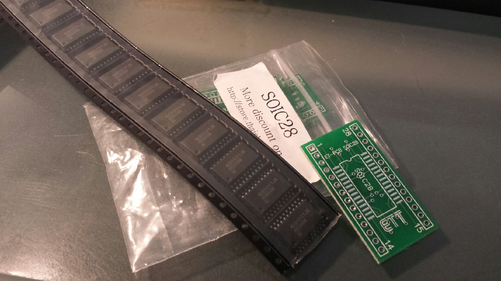

[caption id="attachment\_1416" align="aligncenter" width="450"] Motor control DSP chips[/caption]
So I splurged and go a strip of the [admcf32x](http://pdf.datasheetcatalog.com/datasheet/analogdevices/ADMC328TR.pdf "21xx buried inside").
There was an option for DIP version but I just got a small bag of SOIC28 adapters for the prototyping on breadboards. I have already added the chips to my Eagle library for later.
There is a little work to sort out programming them.  I found assembler, linker and prom exe off the internet (go figure someone kept a copy on a website) so it's just sorting a UART interface for the prototyping. The fun one is the EEPROM boot mode, plenty of aftermarket EEPROM chips but no-one seems to have a programmer for them expect for the manufacturer (which is $$$).  I came close on aliexpress but some vendors there are not technologists so you can't get useful info out of many of them.
I might end up just using a CPLD - we have the tools.
