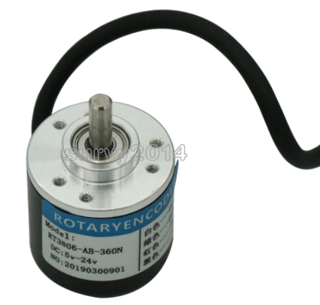
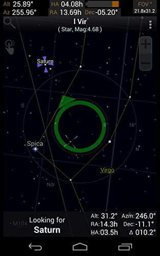

Figure 1

So, I have two encoders en route, along with 4x6mm bore 20 toothed 2GT timing pulleys, and also 10m of 6mm 2GT belt.

I had this idea for the manual pick and place in Figure 2. I am going to fiddle with adding linear position sensors to see about integrating with OpenPNP, to have the software offer steerage commands to help with the movement of chips from source to destination, since there is still a slow process "remembering" where items are stashed and with reading supporting material.

Might be over kill but a bit of fun.

Figure 2

I was thinking about navigation pointer a little like those used in astronomy apps on your phone to guide you to pointing the phone to the right point in the sky. A bit like the one from Sky-Eye, Figure 3. That would be overlaid over the camera stream - I assume you can hack OpenPNP that way.

Figure 3

But the other option, to OpenPnP, appears to be something like [VisualPlace](https://www.compuphase.com/visualplace/visualplace_en.htm).
