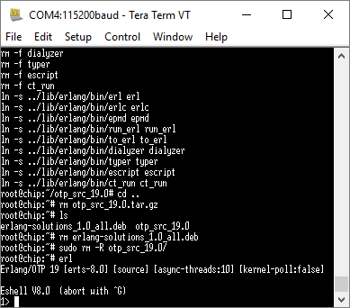

Well, with github and nerves-project.org down (for some dangblasted reason) I tried building Erlang on one of my C.H.I.P. from instructions [here](http://elinux.org/Erlang) (for RaspbreathyPiklette).

Sorta stuck after that as ... github is down.  Git can't find it, ping can't browser can't.  The site reports up and running but still can't connect.
 
