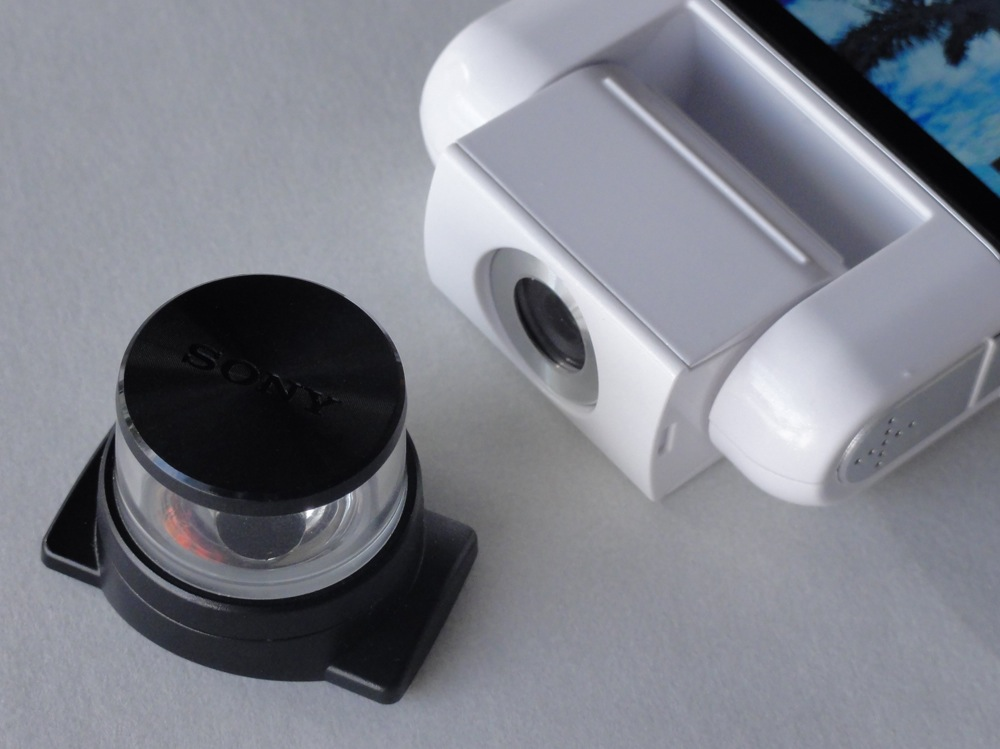
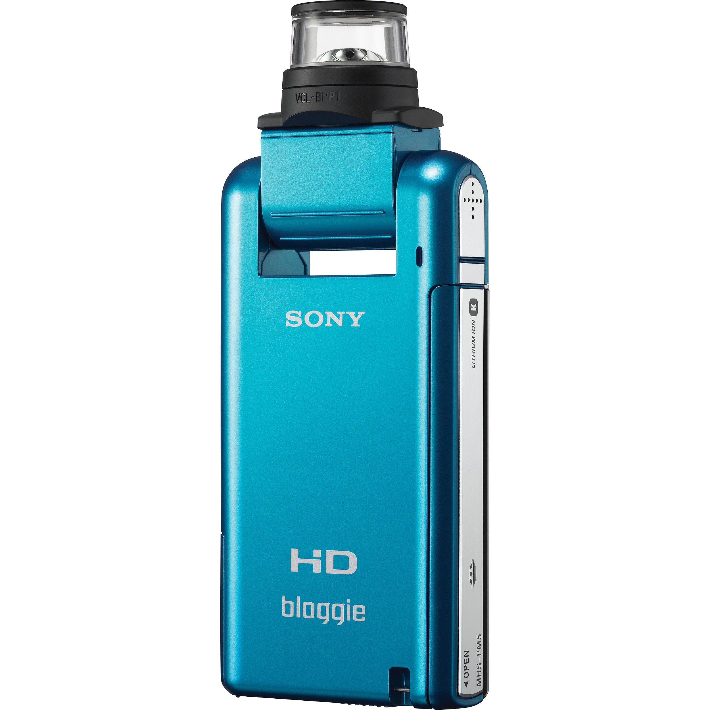
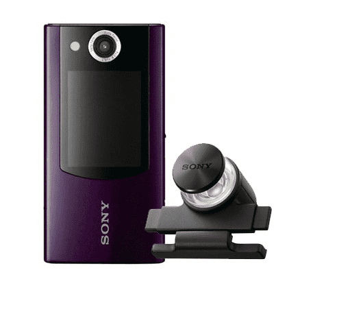
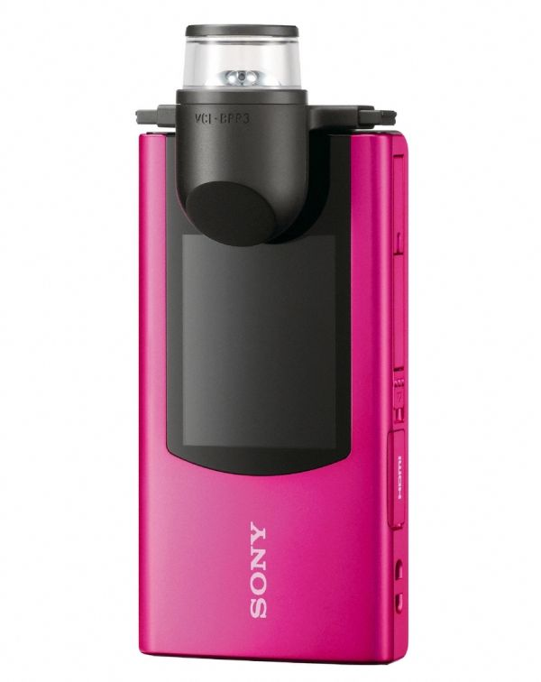
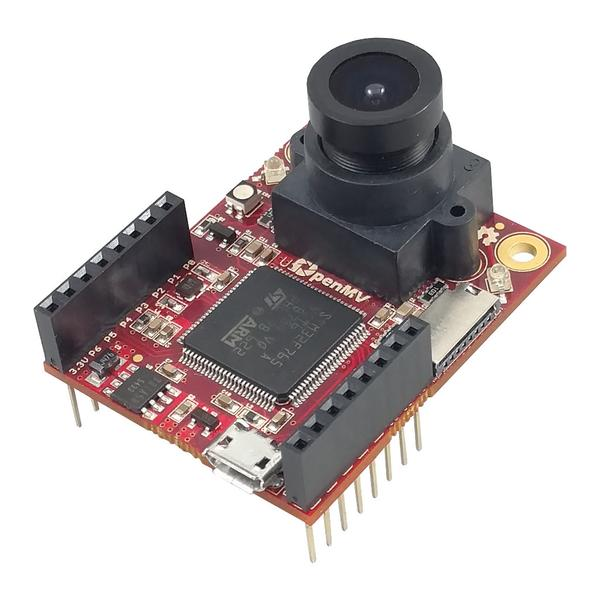
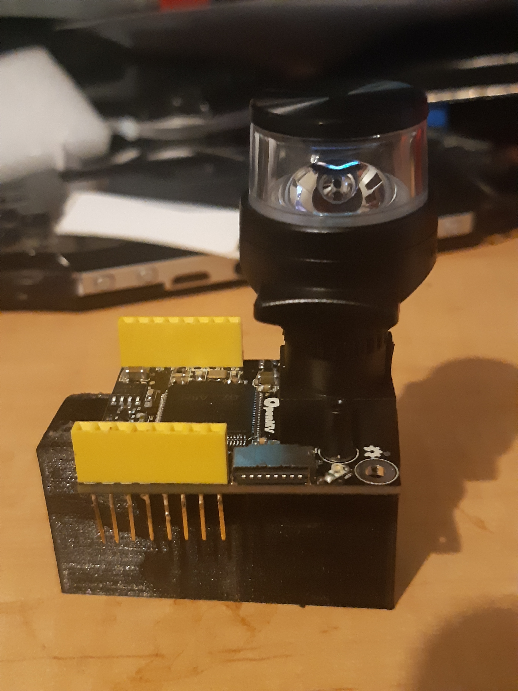

A late find is that the floating point performance of the [ESP32 is a bit sad](https://blog.classycode.com/esp32-floating-point-performance-6e9f6f567a69). The current design of the bloggie lens based idea, for the MHS-FS2 type lenses, was a long lead ov2640, to snake out from the adapter to a TTGO Camera board (see Figure 1). This will still be viable, and there are examples of this [setup doing image processing](https://github.com/joachimBurket/esp32-opencv). But whether that can be at a rate for converting the bloggie image to a panoramic, and then lay processing over the top as well, is a question.

Figure 1

I have a couple of OpenMV cameras as well, that that the MHS-PM5 lenses might be adapted to.

So, the ESP32 system may be less capable but dependant on what the processing needs are, it will be still a useful option.

Strategies exist, anyway, to get around likely lower frame rates. Including streaming the data without processing up to a server, which is apt for smaller robots.

To get the drift, the PM5 lens has a more or less clip onto lens coaxially approach (Figure 2 and Figure 3), whereas the FS2 has a clip on at 90 degrees approach (Figure 4 and Figure 5).

Figure 2

Figure 3

Figure 4

Figure 5

The PM5 lens (Figure 2) thus is a much better mate for the OpenMV M7 I have (Figure 6).

Figure 6

To connect the MP5 lens to the OpenMV M7 appears to only need a simple 3D printed adaption (Figure 7 and then Figure 8)

Figure 7

Figure 8

I am finding it works (needs some fiddly focusing), but I will need try a lens with a narrower field of view perhaps (Figure 9).

Figure 9

https://www.youtube.com/watch?v=MhvNBQOFgkw
