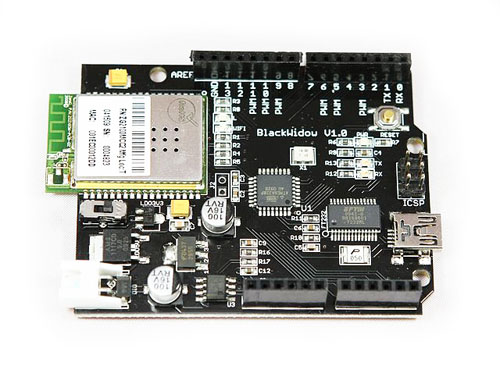

Looking at it realistically, OpenSprinkler hardware is likely a no-go for me.   Why?
When I looked at it rationally, I have the skills and the technology and I have also lamented the "maker" mentality before (buying things and plugging them together rather than designing and constructing).
Besides the $80 for the OpenSprinkler hardware is about what I paid for the Blackwidow board, a few years ago now.  I used the Blackwidow on a now decommissioned project - so it is sitting there wanting to be used.
[caption id="attachment\_1756" align="aligncenter" width="450"] Use me ![/caption]
 
Why waste it?
Besides a four relay shield is in the order of $6 instead of $80.  I have found a mqtt library for Arduino so will need to integrate that with the wifi (rather than ethernet) library etc.
I might even be able to mod the OpenSprinkler software to control relays via mqtt, instead of driving GPIO pins directly.
Yes, one could go NodeMCU and a $4 four relay board and get a controller under $20, and I will for extensions to the irrigation system.  I just need to get the Blackwidow out of the parts draw doing something useful.
 
