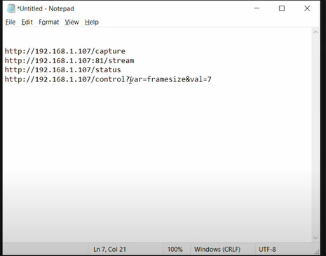
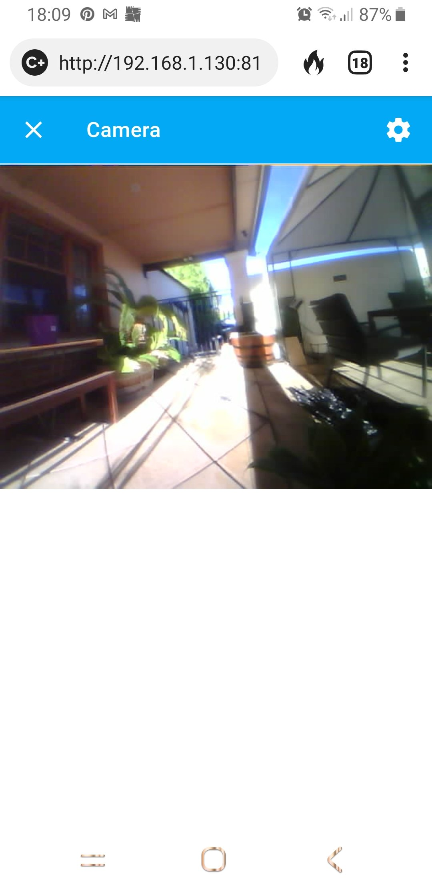

What a pain.


This is the pinnacle of the downside of opensource and the upside at the same time.


ESPHome community, especially, with rules of what you need go through before you're allowed to "ask" and issues "closed" but not promulgated into ESPHome baselines.


Let's recap. Two LilyGo TTGO T-Camera v1.6.2 boards. Same ESPHome yaml file, save for device name and IP.


Problems with, lets' call them board A and board B.


* Both board A and B came with a preinstalled app (probably [this one](https://github.com/Xinyuan-LilyGO/TTGO-Camer-Mic)), which runs on power up. You are supposedly to say "Hi LeXin" to it and it then starts a webservice to display the camera stream. No amount of yelling at the boards incites a response. Obviously something is running as OLED screen scrolls. No biggy, I was wanting to use ESPHome examples I had found, so I could hook the cameras into Home Assistant via ESPHome integration.
* Craft an [ESPHome yaml based upon examples](https://pastebin.com/n7fRtRhM) on the Net.
* Bombed board A, with its own version of the file. No problems apparently, initially - but don't get cocky.
* Bombed board B, with its own version of the file. Would not start however. Would get into boot loop with the board B yaml file so bombed.
* Cut code for board B back to find if I removed the camera code, then the board fired up and "worked" - but with no camera. So, was the camera on board B fragged? Don't rush in with an answer.
* Tried bombing board B with board A yaml file. Board B still sat in boot loop unless camera code removed, so no pesky hidden characters or problems with indenting.
* Now I told you not to get cocky. With no code changes or re-bombing, board A now, occasionally, won't start without multiple bangs on hard reset button. Once up, seems okay. Even fires up again, after unplugging it from powered USB hub then plugging it back in (and then maybe some banging on hard reset), but don't get cocky.
* Tried banging reset button of board B, because the log messages are eerily the same as those on board A when it struggles starting. 5 minutes of banging the reset on board B fails to get it to start.
* I had backed up the original binary running on the boards, so re-bombed them with original code. They came up again.
* Re-bombed both with ESPHome. Now I wasn't sure which board was board A and which was board B. Both flaky. Marked up one board as board A to distinguish. Finally, after re-bombing board A a number of times, including clean, it got back to the point it would start with a number of bangs on the hardware reset.
* Gave up. Assumed as long as I could get it started, board A would do as a video door bell, with IR trigger to tell us when someone was there and maybe not inclined to press the button on the gate. So put the project aside until I found the hour or so to run into Jaycar to get a case.
* Come back a week or so later and FRACK! The OLED board on board A not working. Were it software? Were it hardware? I really only placed it into a box of parts for safe keeping. It seemed to connect to HA. The PIR, button, status and wifi signal all working. Opted to go with it and just not bother with the OLED display. But it bugged me.
* To add insult to injury I had found a bunch of resources, including what appeared code for the [t-camera series](https://github.com/Xinyuan-LilyGO/LilyGo-Camera-Series/tree/master/sketch) but not HA ready. Regardless, I bombed board B with the native t-camera code and voila! The pesky board ran, with camera streaming, confirming the camera was not fragged. But, FRACK! The OLED on board A did not come up. So, looks like a hardware not software frag on board A somehow?
* I opted to then drop the ESPHome code and use the t-camera code, since it was standard mjpeg stream, with control options mind you, with:


[](./ip-camera-urls-1.png)


* Another problem popped up, the example code for an mjpeg camera in Home Assistant, when stashed in configuration.yaml, did not create either a camera entity nor device to use. There was definitely a stream, as you could hook it into a chrome web page and therefore a picture entity. There were no errors reported when HA was started, so no evidence why a camera was not created.
* Yet another problem, the t-camera example was for a single streaming client and I wanted the cameras to come up wherever the HA HMI was brought up. Solution, I found code that provided up to 10 streaming clients, goodnuff for my needs, thanks [arkhipenko](https://github.com/arkhipenko/esp32-mjpeg-multiclient-espcam-drivers)! Just needed to mod the pins descriptions to include the [LilyGO cameras](https://pastebin.com/MMXXxt6E) (based on the t-camera pin definitions by [lewisxhe](https://github.com/lewisxhe)).
* Note, while the allframes option sounds great, there is a substantial lag in the displays because of the spooling. So, great for a dvr set up, but not intuitive for a video door bell. Also wik, note the code defaults to max resolution for the camera, which again causes lag. I opted to set for VGA and used [esp32-cam-rtos](https://github.com/arkhipenko/esp32-mjpeg-multiclient-espcam-drivers/tree/master/esp32-cam-rtos) instead of [esp32-cam-rtos-allframes](https://github.com/arkhipenko/esp32-mjpeg-multiclient-espcam-drivers/tree/master/esp32-cam-rtos-allframes). Might be fixed with a task per client, noting the software only creates a single task to handle all clients. I am going to poke at that in the background, since all the hard work has been done otherwise.
* Notice there are quite a number of boards arkhipenko had included, now with my T-Camera mods (only tested for my v1.6.2 mind you). I am looking at at least adding the OLED for the t-camera and, of course, MQTT and PIR etc.
* Oh yeah, the code from arkhipenko works on both board A and board B. So, it is definitely ESPHome that is struggling either on the t-camera or on ESP32 boards generally.


Now if all that ain't bad enough. The boards, when loaded with ESPHome, seemed to be happiest when plugged into a powered USB hub. When plugged into a WEMOS single 18650 battery shield, they would not work or at least would not start - no matter how many times I banged on the hard reset. That is, neither of the boards would run off battery. So, I thought this was either an amperage or a noise thing. It was strange as I tested with multimeter and seemed fine. Sniffed with my DSO but noise was not an apparent problem.


The final insult then was, when loaded with [original app](https://github.com/Xinyuan-LilyGO/TTGO-Camer-Mic) or either the [t-camera](https://github.com/Xinyuan-LilyGO/LilyGo-Camera-Series/tree/master/sketch) or [rtos](https://github.com/arkhipenko/esp32-mjpeg-multiclient-espcam-drivers) apps, both boards (A and B) ran no problem off the WEMOS battery shield. They just refused to start up or connect to wifi while running ESPHome unless they were hung off the powered USB hub. It's inexplicable but was it worth my time to track down.


Ultimately, it turns out I mis-read the issue at ESPHome issues being "[closed](https://github.com/esphome/issues/issues/405)" meaning the fix had been incorporated into the baseline. It isn't! You still need to dig out this nugget and manually hack your main.cpp code, avoiding the autogenerated sections. Now for whatever reason, not setting pins x=12..15 at start, with pinMode(x, INPUT\_PULLUP) leads to both problems with boot loops, often aggravated if the camera code is included AND, it appears, the problem with t-camera not running or booting on battery (for whatever dang blasted reason). With pullups on those pins even board B now comes up with camera and runs off battery, despite having the ESPHome code running. There is thus a question around EMI in the design of the t-camera v1.6.2 that, luckily, can be fixed with pulling a few pins up.


Make sure then that somewhere in your autogenerate main.cpp code reads (safe to hack, lost when you clean):


```
void setup() {
    pinMode(12, INPUT_PULLUP);
    pinMode(13, INPUT_PULLUP);
    pinMode(14, INPUT_PULLUP);
    pinMode(15, INPUT_PULLUP);
    // ===== DO NOT EDIT ANYTHING BELOW THIS LINE =====
    // ========== AUTO GENERATED CODE BEGIN ===========
```


From accounts I can put together, this problem is with a few ESP32 CAM boards and was dealt with in the code by [lewisxhe](https://github.com/lewisxhe), which is actually where the hack for ESPHome comes from. The hack probably needs to go into ESPHome, so there is a bug report to open the problem again to have it closed in the ESPHome baseline.


Re-bombed to ESPHome, with the hack in both devices main.cpp. Fingers crossed.




So, here is the test setup running.
