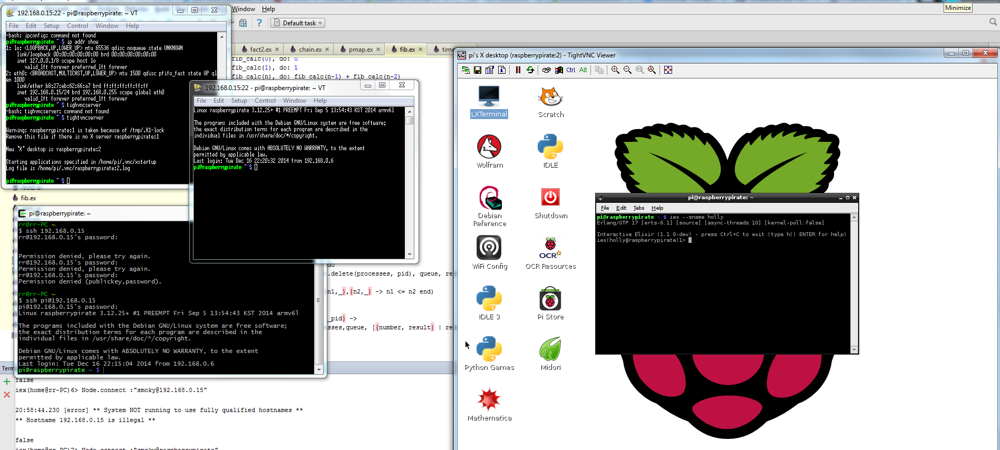
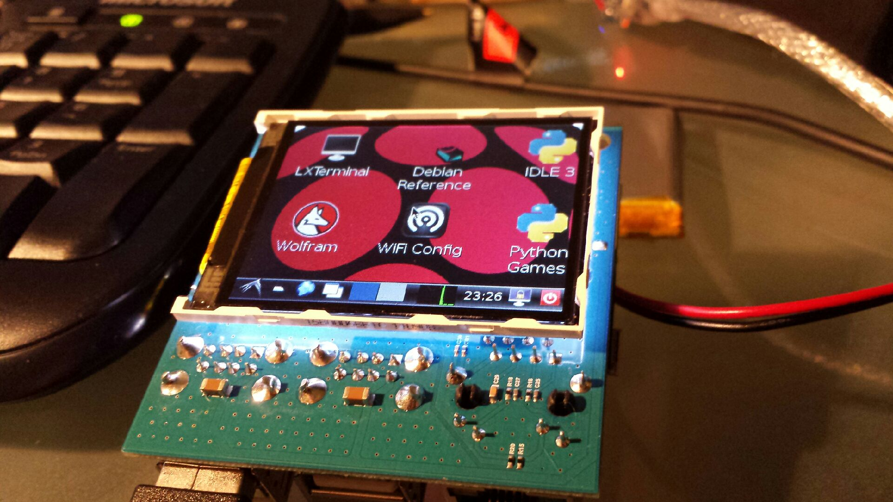

... that was a movie weren't it?

So, with the ethernet connection PLUS the USB to RS232 cable I had  a bit of fun as a study break.  So we've got two Terra Term sessions (one by serial port, one by ssh over ethernet), a cygwin terminal, a TighVNC X session and a terminal running on the pirate.  Silly fun but all I could get into as the study is frazzling the brain somewhat.
Previously I did forget to report the trauma of getting the LCD display going.  Kookie issue, classic in fact.  The font they used for the "code" view on the blog the instructions sat was COURIER, and oldie but goodie font coming from type writer days.
In keeping with the lack of Human Factors considerations the 1 and the  little "L" looked the same so I spent a week of study breaks re-reviewing code until it clicked and voila!
[caption id="attachment\_1718" align="aligncenter" width="660"] Why? Its too small.[/caption]
Now I have to admit I only got the display to rattle my Nephew (since he has a boring old Raspberry Pi without LCD).  It is way too small to be practical.  If it was a touch screen then perhaps it could have been a Programmable Entry Panel (PEP) like what I have used and programmed on some of the defence projects I have worked on.  Will likely be good enough for simple tasks.
I am trying, in the background, to sort out why Lisp for Erlang (lfe) is not installing on this beasty.  Once I get that sorted, with the help of the user group, I will likely dabble a bit.  Stay tuned.
