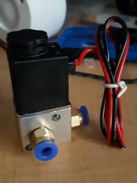

Here's a 3way 2way

Really a normally closed and normally open port plus a sink port. So, no markings and no data I can find to tell which port is which.

A pain, so I will need do some experiments to work out which is which.

Can't have a 3-way not sucking on the right port, right?

If not obvious, this'll go in the manual PnP machine to turn on the sucking.
