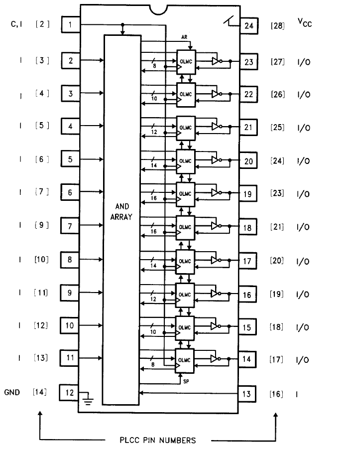
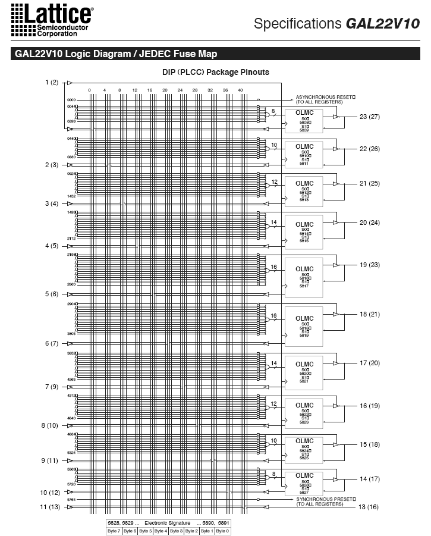
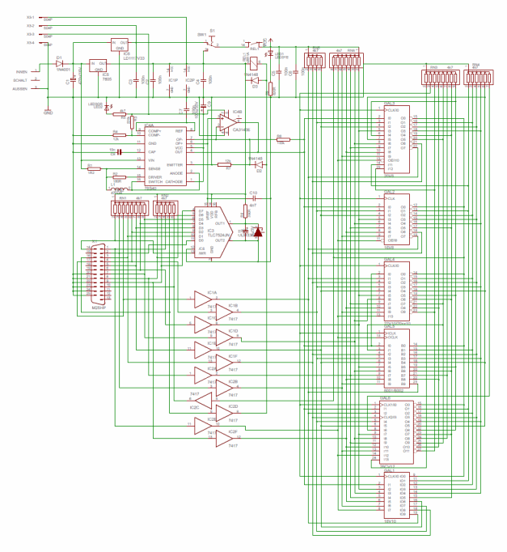
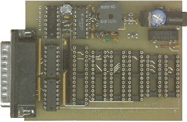
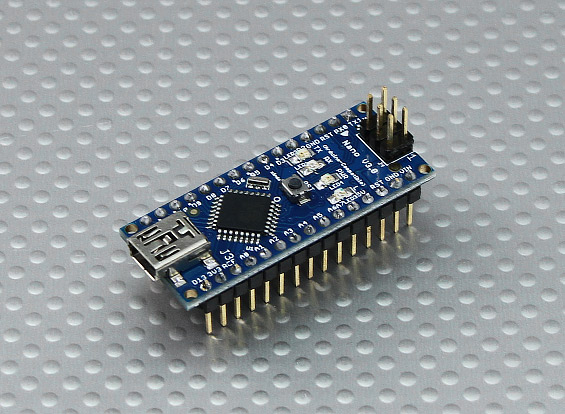
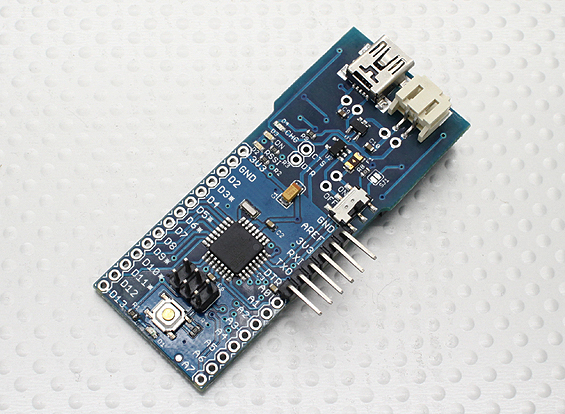
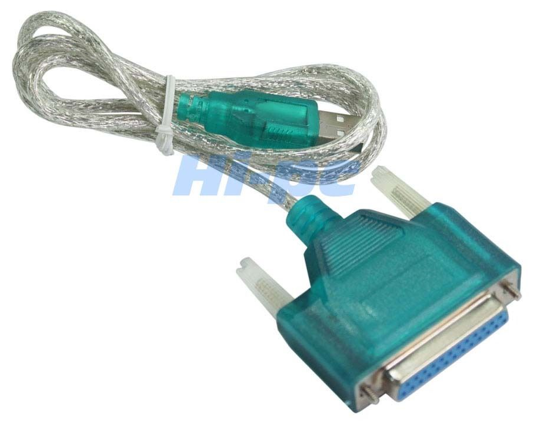

Just having my morning wake up coffee and day dreaming.
So, I got curious after my last post and an accidental find on the internet (or at least a trillion of them).
Seems many GAL/PAL etc that I use to play with have, relatively recently, gone obsolete (go figure) BUT that means trillions of them on the internet for $1 or less.
 
Et cetera.
Problem is programming the pesky things.
I have downloaded CUPL (ex commercial and now free - go figure) and a couple of DOS based PALASM (just to be really kooky).
The problem is that you need a physical programmer.  The chips are, more or less, like PROM chips and you need to blow fuses et cetera.
Luckily a blast from the past is GALBLAST which has Eagle files still available.
 
Go figure, might be fun trying to source some of the components on the thing - but doable.
It restricts the number of chips you can burn but that's fine.
Since I have Eagle PCB editor installed I am tempted to get rid of the DB25 and replace it with either of ...

# OR

To make it a serial programmer.  Although it is tempting to just make a cable to drive it from my MEGA.

# OR

One of these USB to DB25 parallel adapters. This might be simplest first up as it only needs changing the PC programming code around port output and no PCB design work.
