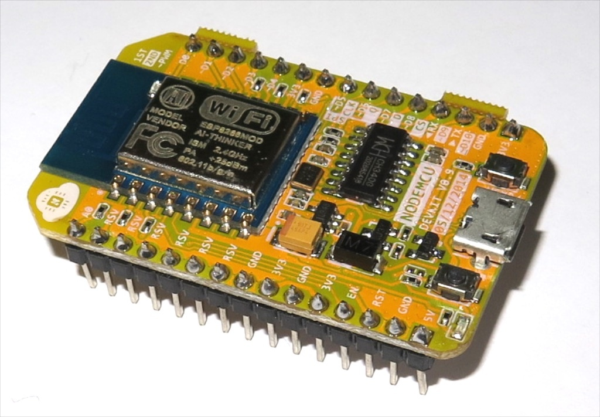

What ever it is, the [ESP 8226](https://nurdspace.nl/ESP8266 "There are plenty of other sites") has read my mind.  Including being able to run [LUA](http://www.lua.org/ "Hoola, oola, mula, doola") and so include [MQTT](http://mqtt.org/ "IBM you've done it again") and also things like [Actors](https://github.com/xfguo/luactor "Marlon Brando?"), [CSP](https://code.google.com/p/luacsp/ "Cooperation Sequential Processes"), [FSM](https://github.com/cornelisse/LuaFSM "Finite State Machine").

 
Especially with [NodeMCU](http://nodemcu.com/index_en.html "Why bother now with ...") on board.

 
Now with ESP 8226+NodeMCU+MQTT, don't forget [Node-Red](http://nodered.org/ "Nifty for tying MQTT widgets together.").
For my MQTT broker I am using, of course, [emqttd](http://emqtt.io/ "Erlang plus MQTT ... neat.") as it is erlang based.
For connecting from python on PC, Raspberry Pirate, Beaglebone Black, one needs [paho-mqtt](https://pypi.python.org/pypi/paho-mqtt "Pythonic mqtt").  MQTT has topic much like ROS does ... hmm ... more reason not to need ROS broker.
In any event ... get it ... event ... never mind, on Android one can use [MyMQTT](https://play.google.com/store/apps/details?id=at.tripwire.mqtt.client&hl=en "MQTT \"sniffer\"") to hook into broker to push and subscribe as a test tool.
