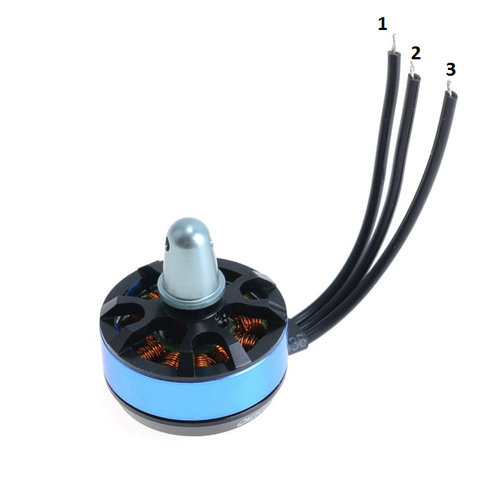
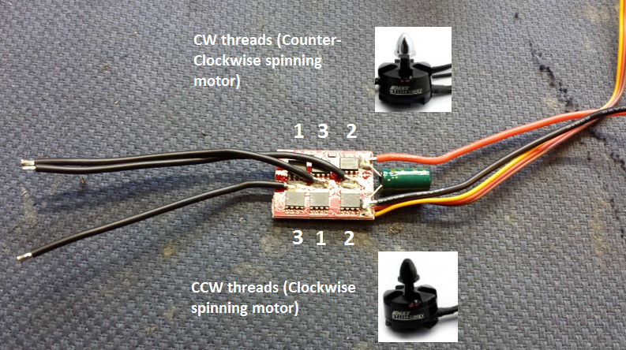

Wiring up your EMAX Simonk 12A ESC with your outrunner.  The motors that come with the kit are the EMAX MT2204-2300KV (not the one in the photo below).  Leads 1, 2 and 3 from left (Figure 1).
[caption id="attachment\_2654" align="alignnone" width="345"] Figure 1[/caption]
Wiring up, if you are soldering directly to the Simonk 12A ESC, below in Figure 2.
This picture will hopefully overcome the confusion generated by some of the verbal descriptions on people's "help" videos and their often fat fingers in the way when they are holding pieces for the camera (look to Figure 1 for the wire numbers that match the numbers in Figure 2).
[caption id="attachment\_2662" align="alignnone" width="793"] Figure 2[/caption]
Wire 2 always goes to the solder pad closest to the capacitor.  The wiring of the other wires (1 and 3) will depend on whether you want the motor to rotate CCW (silver cap) or CW (black cap).  Use the top row numbering for CCW spinning motors, and use the bottom row numbering for CW spinning motors.
