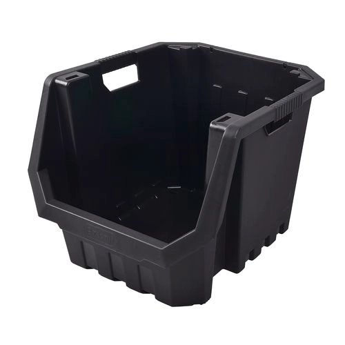
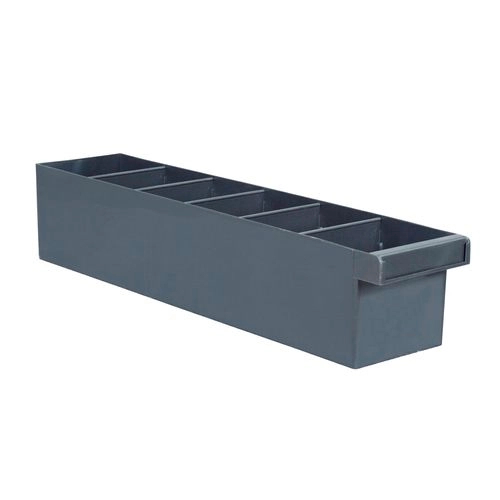
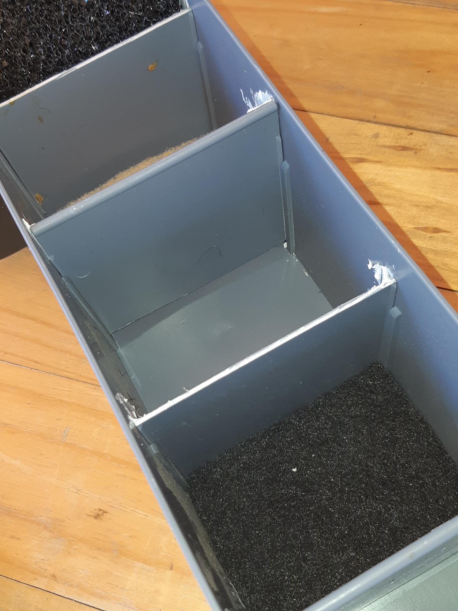
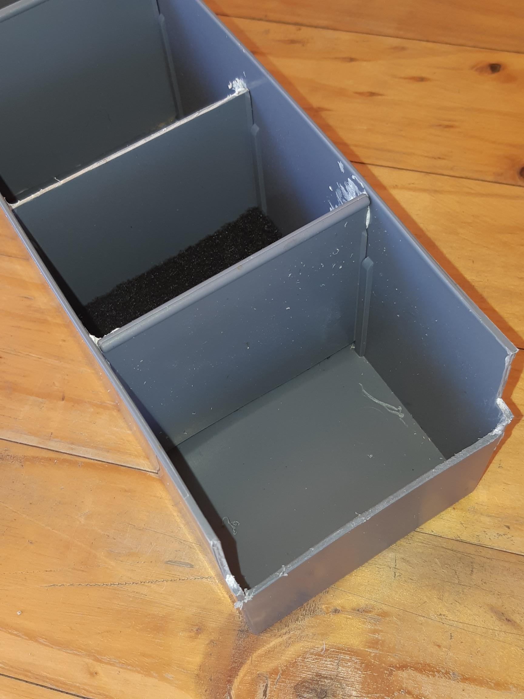
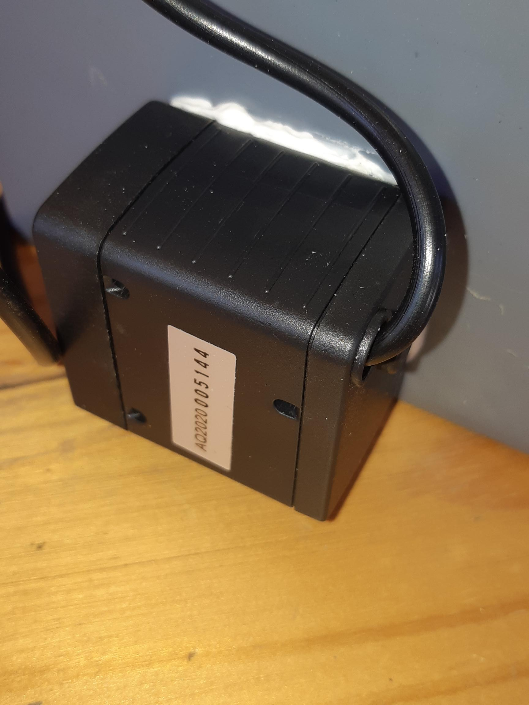
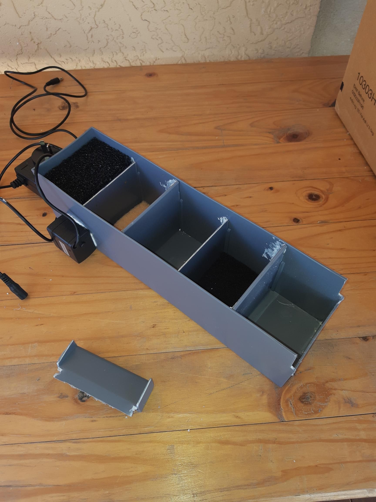
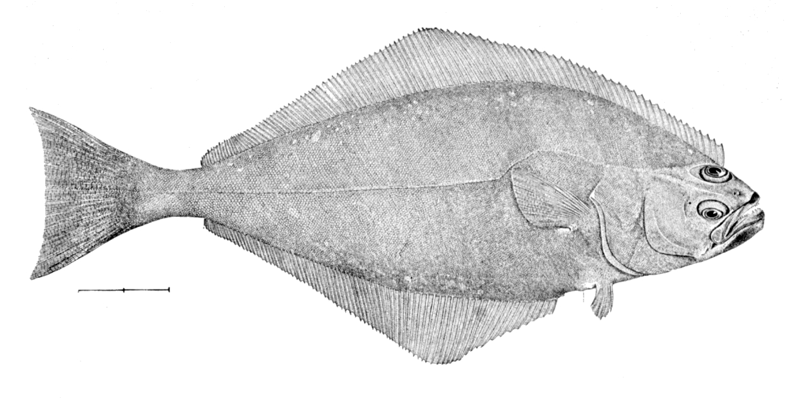
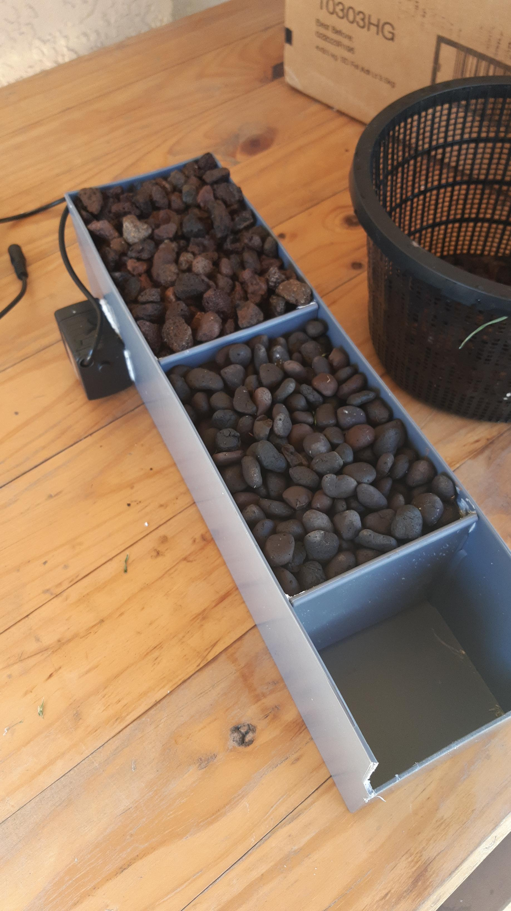
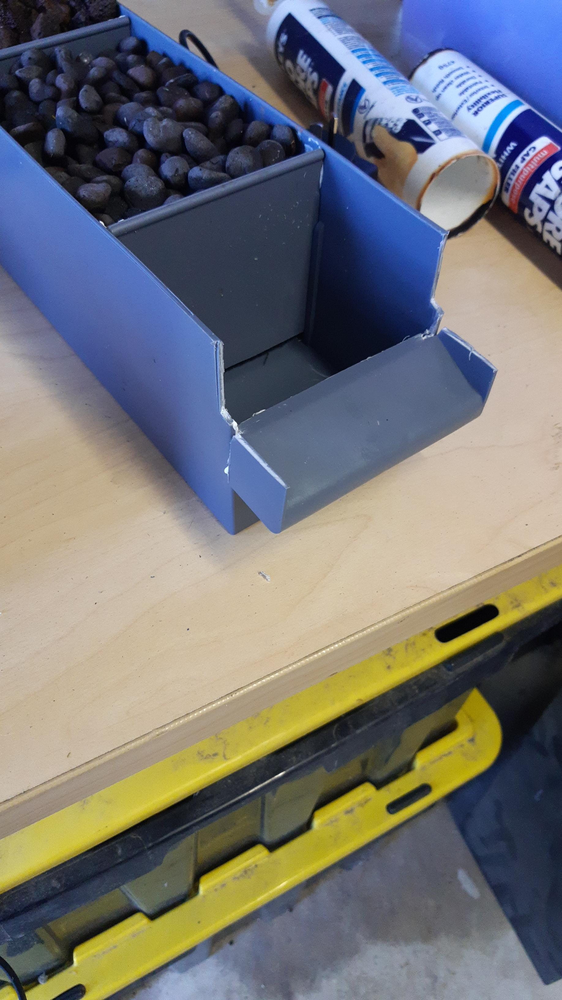

Here's the idea.

A Tactix [stackable bin](https://www.bunnings.com.au/tactix-heavy-duty-multi-purpose-stackable-storage-bin_p2584036) from Bunnings. With an open front to add a mesh door.

A storage tray.

But modify the storage tray to be a horizontal trickle filter.

I did add a pad of nitrate filter and also a pad of charcoal filter in the two "seep under bins". Just for the halibut.

Am I floundering with my humour?

The pull handle was cut off by first running a [Dremel mini saw](https://www.bunnings.com.au/dremel-mini-saw-attachment-670-_p6280410) under the handle, using the handle as a guide.

Of course WATCH YOUR FRACKING FINGERS while handling the mini saw. Read ALL the provided instructions that come with the Dremel mini saw. Count fingers before and afterwards. Count should be the same both before AND afterwards.

To finish the removal of the handle, you'll find that the plastic the tray is made of is actually easy to cut with a good pair of scissors. You will not cut it off completely, but having cut it most of the way through you can fold it until it tears cleanly off. Tidy up with a sharp scraping edge (the blade of the scissors is good enough).

Note the trickle floods the filter alternatively over/under/over/under and then over. It will be filled with volcanic rubble, porous fired clay and probably a final stage using special filter beads. I do note that the succulents we have by a pond out back have creeped into the pond and so have provided a useful means to also remove nutrients from the water, so small succulents planted in the beads for sure.

The over/under is achieved by alternatively cutting either the top ("over" partition) or the bottom ("under" partition) off each alternate removeable partition. The "over" partition is inserted all the way to the bottom, leaving a gap at the top. The top of the "under" partition is kept at the height of the sides, to leave a gap at the bottom.

Simple, tich!

[Pond pump](https://www.bunnings.com.au/aquapro-ap210-tabletop-water-feature-pump_p2810296) from Bunnings also. It is adjustable so hopefully enough to tune the flow.

Filled with porous lava and porous fire clay beads

Naught goes to waste, the pull handle becomes a slipway

https://www.youtube.com/watch?v=NWkoh4UIb1o
