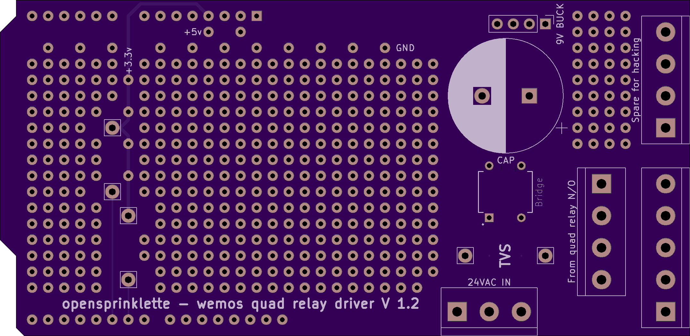
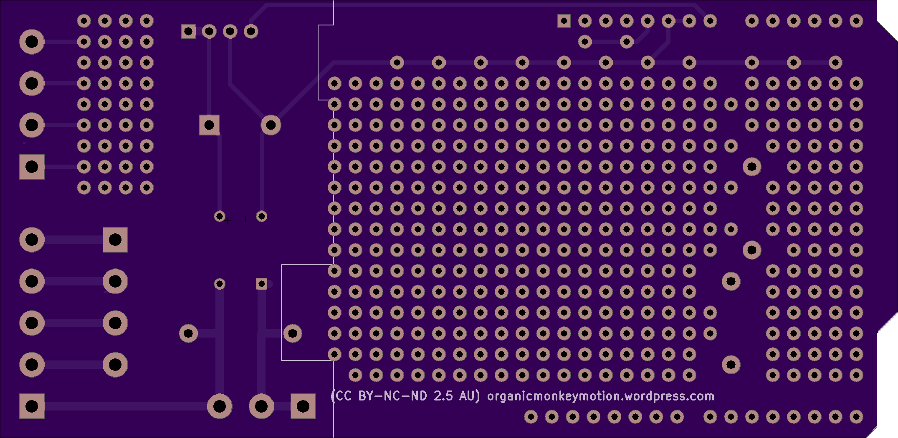
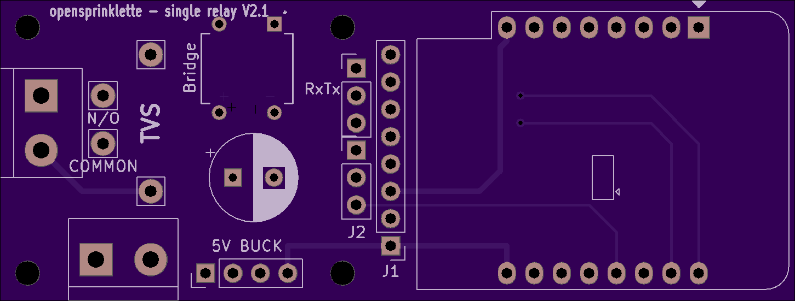
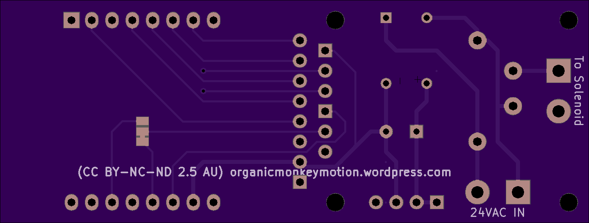

Presenting the quad board. Added additional terminal blocks to help manage the wiring. Added prototyping area to allow for additional hardware hacking, including four terminals for additional I/O. Notice GND, +5V and +3.3V power rails.

***Top side of Opensprinklette quad board***

***Bottom side of Opensprinklette quad board***

Presenting the single board. Added additional terminal blocks to help manage the wiring. Brought as many pins out as I dared to a pair of headers (J1 an J2). J2 also has associated solder jumper (on bottom of board) to help with option of V1 or V2 of Wemos mini relay board. The solder jumper on the Opensprinklette V2.1 sets the mode of J2 pin 2.

If you are using a version V1 of the Wemos mini relay board you don't have options, as D1 drives the relay and you don't get then to use I2C. Jumper defaults J2 to Pin 1=D2, Pin 2= D3 and Pin 3= D4. You lose D0 in any event since its set aside for V2 of the Wemos D1 mini relay board.

If you are using a version V2 of the Wemos mini relay board you change the jumper on Opensprinklette single to set J2 to Pin 1=D2, Pin 2= D1 and Pin 3= D4 . Effectively you lose D3. You need also to change the relay driver pin on the Wemos D1 mini relay board to D0 (from D1), using the solder jumpers on the Wemos D1 mini relay board.

***Top side of Opensprinklette single board***

***Bottom side of Opensprinklette single board***

#### J1 pinouts

|  |  |
| --- | --- |
| Pin | Use |
| 1 | +5V |
| 2 | GND |
| 3 | +3.3V |
| 4 | A0 |
| 5 | D5 |
| 6 | D6 |
| 7 | D7 |
| 8 | D8 |

D0 and D3 are not that exciting to lose in either event. D5..D8 gives you access to SPI so you either have SPI if using V1 Wemos mini relay or SPI and I2C if using V2 Wemos mini relay. Not a bad trade off. Not to mention UART is also brought out.

#### RxTx pinouts

|  |  |
| --- | --- |
| Pin | Use |
| 1 | GND |
| 2 | Tx out |
| 3 | Rx in |
