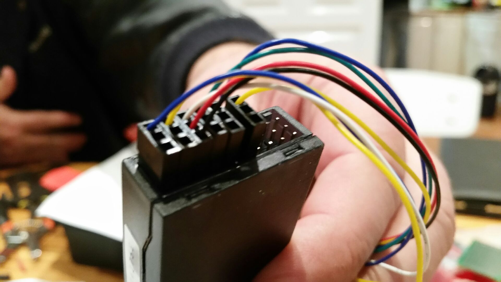
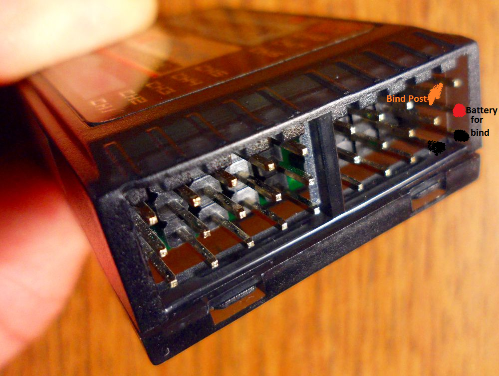
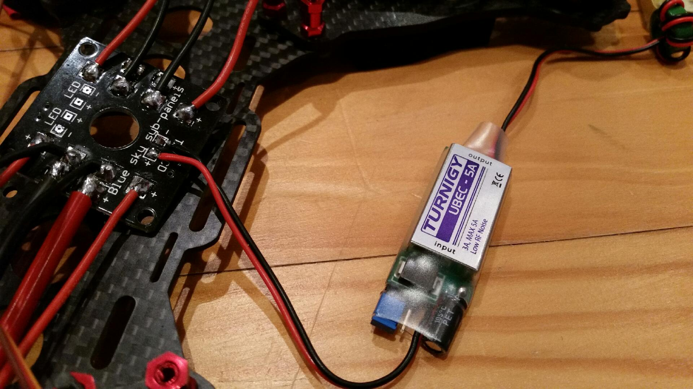

No info on the Turnigy 9x8C V2 receiver \*groan\*.
Turns out SIGNAL on the top row.
PWR is middle row.
GND is bottom row.
Figures ... it's same arrangement as servos.
Gotcha though is the wiring on the cabling to the receiver, from the CC3D, does not match the colours that the LibrePilot site declares.

My "hand" model Jon deftly holding for the money shot, the white wire is actually signal three it seems as it is the fifth not third (after GND and PWR).  No matter word was you can 1) have the power input to Rx on any channel and 2) you can adjust the configuration using the GCS software.
So many fingers in the way on internet "help" sites so the following for your reading convenience.

The other gotcha is Rx cannot be connected to the LiPo.  The CC3D can be connected directly to the LiPo, it has a regulator on it so it is happy with volts between 4.8 and 15.  The twist is whatever you apply to the CC3D PWR pins all PWR output will be that input voltage.  Therefore, one needs a regulator added to apply 5V to the CC3D so the Rx only gets 5V.  I happened to have a couple of UBEC in my part's drawer.  This is attaced to the Tx pads on the power distribution panel (so what!) and would normally be used for the telemetry Tx.  Works just as well as the pick off for the CC3D and thence Rx.

  I had a half dozen UBEC for AIO in my drawer. Lucky.
 
